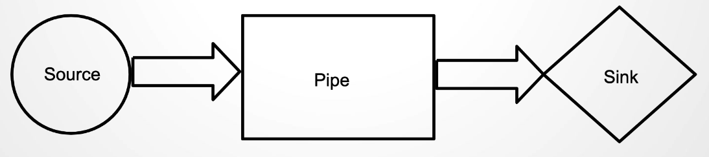
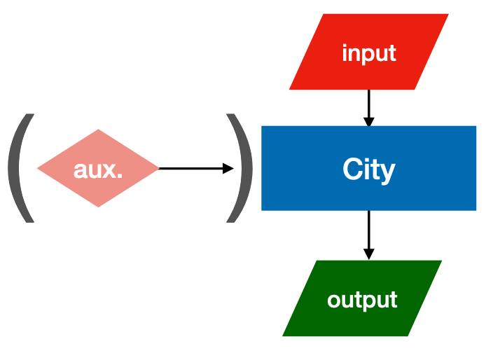
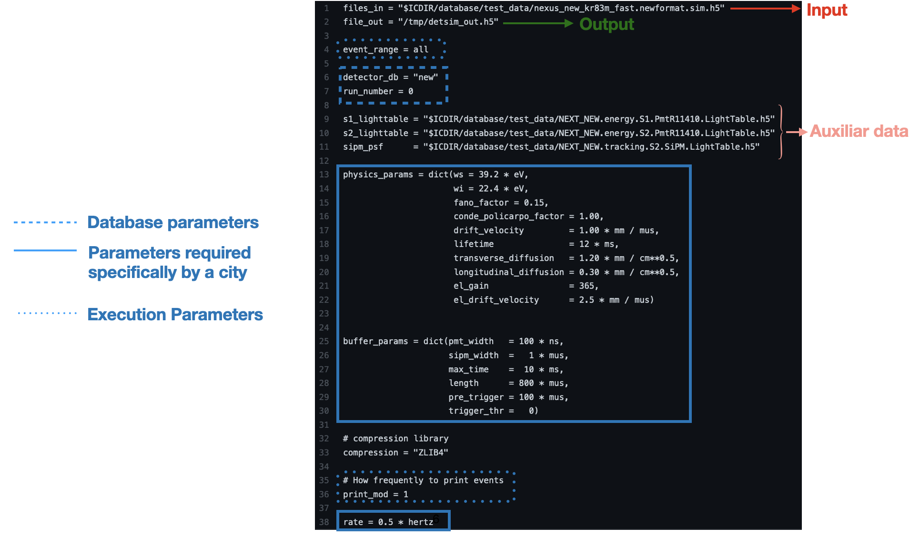
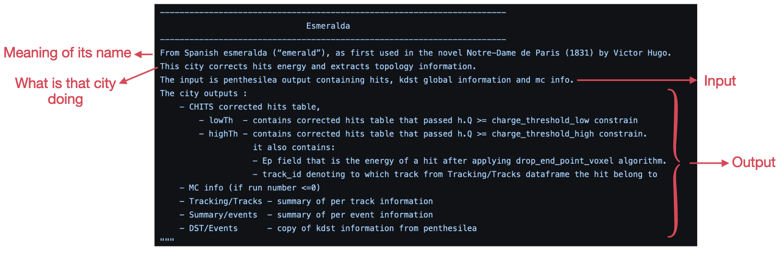

IC
=====

IC stands for *Invisible Cities* and can be found on Github as `next-exp/IC <https://github.com/next-exp/IC>`_.

**Language**: Python; **Based**: Numpy, Pandas

This section is focused on reviewing how the code is structured and where the installation guides can be found.

.. _ICcode:

Code
------------

IC is a reconstruction software structured in algorithms/programs named *cities*. The code is written Python, but it uses `Numpy <https://numpy.org/>`_ and `Pandas <https://pandas.pydata.org/>`_ for data analysis and as a manipulation tool.
Each of the *cities* is focused on different reconstruction tools of the code (e.g. raw waveforms integration, energy correction, deconvolution, etc...), and follow *dataflow* data processing: they resemble a pipeline of data transformations. More details about the dataformat can be found in a previous IC-crash-course in `Dataflow <https://github.com/mmkekic/IC-crash-course/blob/master/presentations/Dataflow.pdf>`_ section.
A complete review about the IC repository can be found on a previous IC-crash-course under `IC-structure <https://github.com/mmkekic/IC-crash-course/blob/master/presentations/IC_structure.pdf>`_.

.. _ICinstallation:

Installation
------------

There is a *Quickstart guide* at the next-exp/IC repository with anything related to its installation. When compiling it, `conda <https://docs.conda.io/projects/conda/en/latest/index.html>`_ will be installed and it will be created the appropriate IC environment, as well as it will be set the environment variables which are needed for the correct functioning of IC.

City Structure
----------------
IC cities follow dataflow data processing: they are designed to resemble a pipeline. By reading this pipeline one should be able to understand what operations are made and in which order.

More details about how this data format works can be found in a previous `IC-crash-course <https://github.com/mmkekic/IC-crash-course/blob/master/presentations/Dataflow.pdf>`_.
Resembling this pipeline structure, each city needs a specific type of *input* data format, and creates a specific *output* to follow the rest of the production flow:

How to run a city
--------------------
Cities may require some parametrisation and, as it is represented on the previous figure, some of them require additional auxiliar (*aux*) data (like maps, PSFs, etc).
Configuration files (*config*, ``config_file_city.conf``) provide to the city this specific information they require to run. Examples for each city are located in `IC/invisible_cities/config <https://github.com/next-exp/IC/tree/master/invisible_cities/config>`_. Official production config files (and production
scripts) are located in `next-exp/CERES <https://github.com/next-exp/CERES>`_ repository.

Once it is clear the parametrisation needed to run a city (once IC environment is set), you just need to type:

.. code-block:: text

  city city_name config_file_city.conf

where ``config_file_city.conf`` corresponds to the specific configuration file for that city.

List of Cities
------------------
IC cities can be categorised depending on their purpose on the following list:

MAIN PRODUCTION:
 * Irene
 * Penthesilea
 * Dorothea
 * Esmeralda
 * Beersheba
 * Isaura
 * Eutropia

CALIBRATION:
 * Phyllis
 * Trude
 * Beredice

ONLY FOR MC:
 * Detsim
 * Buffy
 * Diomira
 * Hypathia

DEBUGGIN/CONTROL:
 * Isidora

Each of this cities include a small description in the IC repository (`IC/invisible_cities/cities <https://github.com/next-exp/IC/tree/master/invisible_cities/cities>`_),

and under :doc:`prodflow` a complete review of the IC cities chain can be found for both data and simulations.

Contact
------------

If you are missing something, or you would like to contribute,
contact any of our **Software Manager**: `Gonzalo Martínez-Lema <gonzaponte@gmail.com>`_

If you have any question, or you would like to discuss something related to NEXUS with other users or developers,
you can also write on the **Slack Channels**:

 * *#IC_support*: Support channel for users to raise issues and questions.
