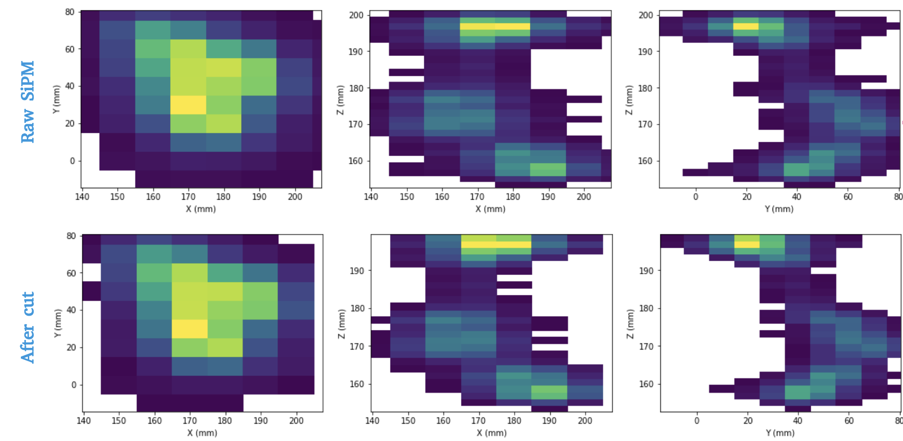
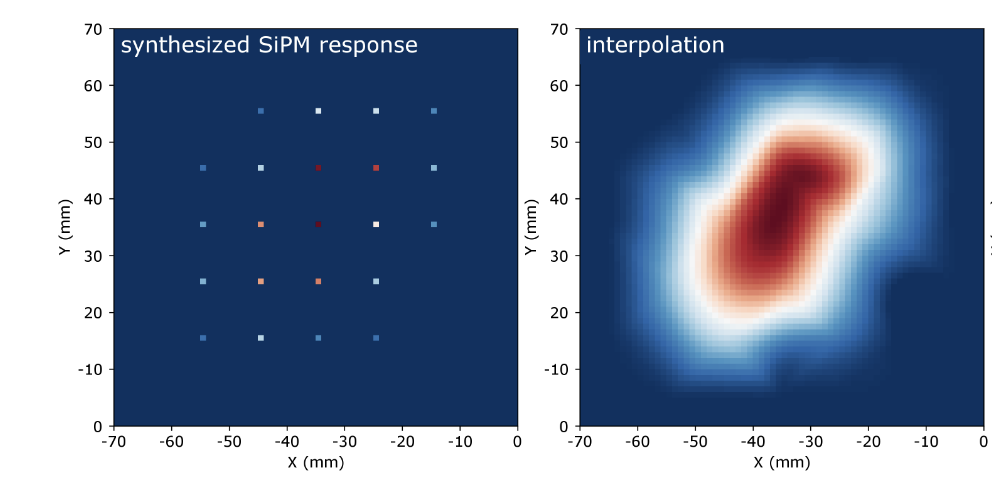
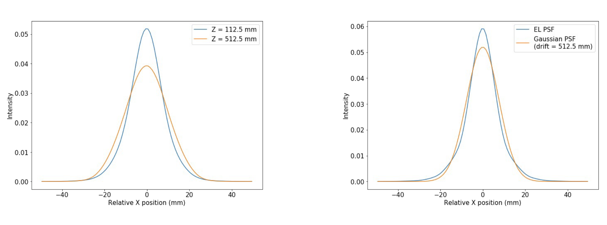
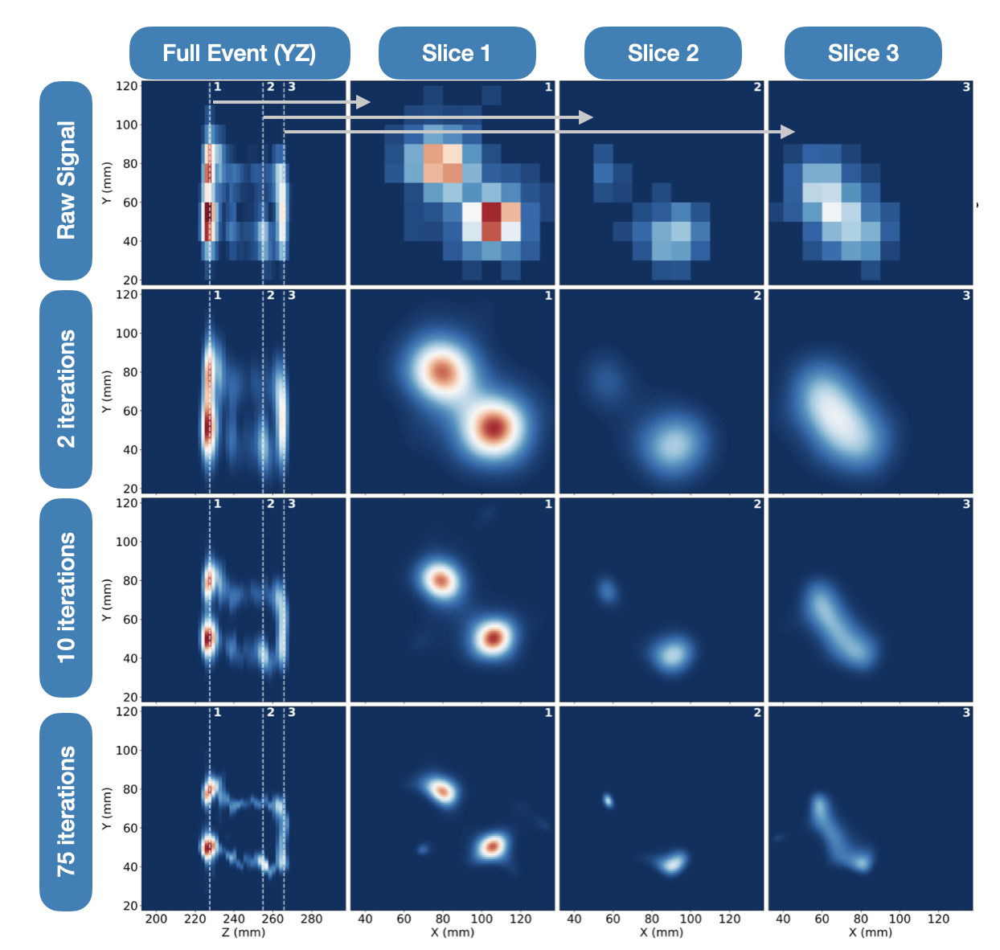
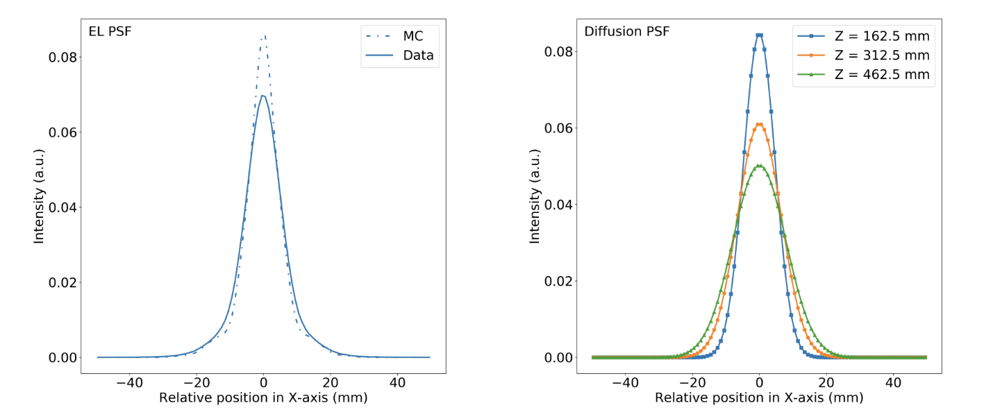

Beersheba
==========

*a city suspended from the heavens, inhabited only by idealists*

The classical reconstruction using the SiPM hits and voxels is affected by two blurring
mechanisms which degrade the quality of the reconstructed track: **electron diffusion**
and **electroluminiscence (EL) light production**. Both blurring effects can be quantified
in terms of Point Spread Functions (**PSF**\ s). Beersheba interpolates corrected hits (**cdst**\ s)
from :doc:`esmeralda` and applies applies the Richardson-Lucy (RL) deconvolution algorithm in order to reverse
the already mentioned blurring effect. This iterative process takes advantage of the **PSF**\ s
estimated using Kr events in the whole TPC volume. The output of this city is deconvolved hits (**ddst**\s) that
are used for track and blob reconstruction in :doc:`isaura`.

Input
-----

* ``/Run/events``
* ``/Run/runInfo``
* ``/RECO/Events``
* ``/CHITS/lowTh``
* ``/Summary/Events``

.. _Beersheba output:

Output
------

 * ``/DECO/Events``: deconvolved hits for each event.
 * ``Run info``: copy of the run information. The tables included are: ``/Run/events`` and ``/Run/runInfo``.
 * ``MC info``: copy of the Monte Carlo information for the events that the city outputs. Only if ``run_number`` < 0. The tables included are: ``/MC/configuration``, ``/MC/hits``, ``/MC/particles``, ``/MC/sns_positions``, and ``/MC/sns_response``.
 * ``/Summary/Events``: global information related to the event. Each row is one event.

.. _Beersheba config:

Config
------

Besides the :ref:`Common arguments to every city`, *Beersheba* has the following arguments:

.. |br| raw:: html

      

.. list-table::
   :widths: 50 40 120
   :header-rows: 1

   * - **Parameter**
     - **Type (Option)**
     - **Description**

   * - ``q_cut``
     - ``float``
     - Minimum charge (pes) on a hit (SiPM).

   * - ``drop_dist``
     - list[``float``]
     - Distance to check if a SiPM is isolated in *mm*.

   * - ``bin_size``
     - [``float``, ``float``]
     - Size of the interpolated bins in *mm*.

   * - ``sample_width``
     - list[``float``]
     - Sampling size of the sensors (usually the pitch) in *mm*.

   * - ``inter_method``
     - ``str`` (**None**, '**linear**', '**cubic**')
     - Sensor interpolation method. If **None**, no interpolation will be applied. '**cubic**' not supported for 3D deconvolution.

   * - ``psf_fname``
     - ``string`` (filepath)
     - File of the Point-Spread Function.

   * - ``e_cut``
     - ``float``
     - Cut to the voxel values of the deconvolution output. Then, ``cut_type`` specifies if the value is absolute or relative.

   * - ``cut_type``
     - ``str`` ('**abs**', '**rel**')
     - Cut mode to the deconvolution output using ``e_cut``: |br| '**abs**': cut on the absolute value of the hits. |br| '**rel**': cut on the relative value (to the max) of the hits.

   * - ``iteration_tol``
     - ``float``
     - Stopping threshold (difference between iterations).

   * - ``n_iterations``
     - ``int``
     - Number of Lucy-Richardson iterations to be applied if the ``iteration_tol`` criteria is not fulfilled before.

   * - ``energy_type``
     - ``str`` ('**E**', '**Ec**')
     - Marks which energy type ('**E**' for uncorrected energy, '**Ec**' for corrected energy; see :doc:`esmeralda`) should be assigned to the deconvolved track.

   * - ``deconv_mode``
     - ``str`` ('**joint**', '**separate**')
     - '**joint**': deconvolves once using a PSF based on Z that includes both EL and diffusion spread approximated to a Z range; |br| '**separate**': deconvolves twice, first using the EL PSF, then using a gaussian PSF based on the exact Z position of the slice.

   * - ``diffusion``
     - tuple(``float``)
     - Diffusion coefficients in each dimension (:math:`\text{mm/}\sqrt{\text{cm}}`) used if ``deconv_mode`` is '**separate**'.

   * - ``n_dim``
     - ``int``
     - Number of dimensions used in deconvolution, currently only 2 max. |br| For ``n_dim`` = 2, slice by slice XY deconvolution. |br| For ``n_dim`` = 3, XYZ deconvolution (in the works).
   * - ``n_iterations_g``
     - ``int``
     - Number of Lucy-Richardson iterations for gaussian in '**separate**' mode.

.. _Beersheba workflow:

Workflow
--------

Beersheba algorithm uses corrected energy hits from :doc:`esmeralda`. More concretely,
the set of hits with a low threshold applied (``CHITS/lowTh``). This is done in order
to have more information about the SiPMs collected charge, since additional manipulation
than in the classical reconstruction is applied to the data.

Beersheba reconstruction runs over the individual SiPM time-slice hit maps that are defined
over a time interval of normally :math:`\delta t  =  2~\mu\text{s}`. Each slice
is considered to be fully independent from the others and longitudinal spread is not
taken into account. For a slice recorded at time :math:`t`, a physical slice of width

:math:`\delta z =  v_{d}\cdot\delta t`

of the original 3D track is associated at the corresponding drift distance

:math:`z =  v_{d}\cdot(t - t_{0})`.

A set of cuts are considered on each slice, prior and after the implementation of RL
deconvolution. These are applied in following order:

• :ref:`Energy cut in sensors <Cut-Sensors>`
• :ref:`Drop isolated sensors <Drop-Sensors>`
• :ref:`2D Interpolation <Interpolation>`
• :ref:`Richarson Lucy Signal Deconvolution <Deconvolution>`
• :ref:`Cleaning Cut <CleaningCut>`
• :ref:`Energy Allocation <Energy-Allocation>`

The first three steps (:ref:`Cut Sensors <Cut-Sensors>`, :ref:`Drop isolated sensors <Drop-Sensors>`,
:ref:`2D Interpolation <Interpolation>`) aim to generate a reasonable estimate for the actual photon
hit pattern on the tracking plane. They reflect a pragmatic approach to bridge the empty spaces
(and hence lack of information) between the SiPMs, and to avoid distorting the image by distant effects,
such as reflections from the various TPC surfaces, or distant EL light emission by photoelectrons
ejected from the gate mesh. The :ref:`interpolation <Interpolation>` step is justified as the smearing
effects of both electron diffusion and EL light spread produce gradual changes in light intensity on
the tracking plane.

.. _Cut-Sensors:

Energy Cut Sensors
::::::::::::::::::::

In this first step, sensors with a charge below a energy threshold, config variable ``q_cut``, are
removed for each slice. This sensors cut cleans the signal and removes hits considered not part of the image.
It should be taken into account that cutting too low may lead to the inclusion of distant signals
(reflected light or photons induced by photoelectrons emitted from the gate), while cutting too
high may bias and distort the output.

.. note::
  In the deconvolution applied in NEW, a ``q_cut`` value of 10 PE was applied (compared to 30 PE used in the classical analysis).

.. _Drop-Sensors:

Drop Isolated Sensors
::::::::::::::::::::::::

This cut drops single sensors if there are no adjacent non-zero neighbours in the same slice (in XY directions) that have seen
light in the event. The distance of this cut can be configurable under the ``drop_dist`` parameter.
This cut is applied to avoid filling the region between the main track and isolated SiPMs which fluctuate
above the charge threshold ``q_cut`` by non-physical data in the subsequent interpolation step. After removing
isolated sensors, the energy is distributed through the reminding hits so the total energy of the event remains the same.

In the picture below [#]_ it is represented impact of the :ref:`Cut Sensors <Cut-Sensors>` and :ref:`Drop isolated sensors <Drop-Sensors>`
cuts over the raw signal of a 2nubb event in NEW.

.. _Interpolation:

2D Interpolation
::::::::::::::::::

Prior RL deconvolution, the full pattern of photon hit points around the SiPM position are estimated
with a 2D interpolation. In the picture below it is possible to see a reconstructed pair of nearby Kr
events from detector data, synthesized by overlaying SiPM response maps for two nearby events. Left plot
represents raw (synthesized) SiPM data, right one, same signal after a interpolation.

A two dimensional regular grid of ``bin_size`` x ``bin_size`` :math:`\text{mm}^{2}` size is defined
surrounding the SiPMs which have survived steps :ref:`Cut Sensors <Cut-Sensors>` and :ref:`Drop isolated sensors <Drop-Sensors>`.
Margins of ``sample_width`` :math:`\text{mm}` are considered around them. Several interpolation methods, defined under ``inter_method`` config variable, are allowed in Beersheba
under the following name:

• **'linear'**: linear polynomials to construct new data points, first in one direction, and then again in the other one.
• **'cubic'**: a third-degree polynomial is used for interpolating data points on a two-dimensional regular grid.
• **'nearest'**: nearest-neighbours interpolation, can be used in one or several directions, and selects the value of the nearest point and does not consider the values of neighboring points at all, yielding a piecewise-constant interpolant.

In the following drawing [#]_ a schematic representation of how these interpolations methods work is summarised.

.. image:: images/beersheba/interpolation_methods.png
  :width: 80%

.. note::
  In the NEW analysis, no significant differences were observed in the final outcomes of the analysis (signal
  efficiency and background acceptance for double escape peak events) when replacing bicubic by linear interpolation.

.. _Deconvolution:

RL Deconvolution
::::::::::::::::::

Deconvolution is applied iteratively, maintaining the overall charge of the event. Currently, Beersheba
runs a 2D RL deconvolution, this means that it is applied slice by slice. To do so, the code uses the
corresponding z dependent PSF needed for each of the event slices, and maintains the overall charge
of each slice constant. Depending on how the PSF information is handled, two different *modes* of deconvolution
can be applied, specified under the ``deconv_mode`` config variable:

• **'joint'**: it uses the PSF closest to the event/slice’s mean position that includes both EL and diffusion effects at the same time. See left plot in the figure below.
• **'separate'**: Selects the PSF in the event/slide with only EL spread and apply deconvolution using it. Afterwards, creates a gaussian PSF based on the Z position of the slice, and the deconvolution is applied again to the output of the first one. See right plot in the figure below.

An appendix at the end of this page can be found describing in detail the :ref:`deconvolution PSFs <PSF_Beersheba>`.

.. note::
  In the future, if a 3D deconvolution is implemented, it would be necessary to provide the ``n_dim`` parameter.

The iterative 2D deconvolution process in each of the slices is represented in the following picture for a 2nubb event.
It can be seen how the reconstructed signal becomes more clear as the number of iterations increases.

Deconvolution process finishes when any of the stopping criteria occurs:

• absolute number of iterations, ``n_iterations``, is reached;
• or the threshold on the relative change between iterations is reached, ``iteration_tol``.

RL deconvolution is implemented in Beersheba using the Richardson-Lucy function from Python’s scikit-image library. Additional
details about how the RL deconvolution works and the way the PSFs are implemented can be found in the RL publication [#]_.

.. _Satellite-Killer:

Satellite Killer
:::::::::::::::::

A common issue within the deconvolution process is the creation of 'satellite tracks'.
These are small artificial energy deposits that exceed the later applied cleaning cut, generated
due to energy that is unable to be deconvolved back to it's initial point and instead coalescing
around the main track (hence satellites). This can be seen in the plot below on the left.

**Satellite killer** is an algorithm introduced to remove these satellites *during* the deconvolution
process, allowing for a resulting track that contains no artificial hits as seen on plot below on the right. 
It is fine-tunable, allowing the end user to change the strength of the implementation easily.

.. image:: images/beersheba/satellites.png
  :width: 100%

These parameters are stored within the dictionary ``satellite_params``, and described below:

.. |sk| raw:: html

     <sk>

.. list-table::
   :widths: 50 40 120
   :header-rows: 1

   * - **Parameter**
     - **Type (Option)**
     - **Description**

   * - ``satellite_start_iter``
     - ``int``
     - Iteration no. when satellite killer starts being applied.

   * - ``satellite_max_size``
     - ``int``
     - Maximum size of a satellite deposit, above which they are considered 'real'.

   * - ``e_cut``
     - ``float``
     - Cut in absolute/relative value to the provided deconvolution output for satellite discrimination.

   * - ``cut_type``
     - ``str`` ('**abs**', '**rel**')
     - Cut mode within satellite killer, applied identically to the normal ``cut_type``.

The satellite killer allows for this discimination by applying an energy cut to the deconvolved z slice across each iteration. 
This energy cut outputs a binary array of 0s and 1s. A simple algorithm is then used to group these zeros and ones based on
their relation to one another (groups of 1s are together, groups of 0s are together), and their size is calculated accordingly.
If the size of one of these groups is below the expected size, it is removed explicitly by setting the corresponding group values
to zero. For a more in-depth explanation of this process, 
click this `link <https://gist.github.com/jwaiton/fd14f43e8da28a49c9c49d43eb00f53f>`_.

.. _CleaningCut:

Cleaning Cut
::::::::::::::::::

Once the deconvolution is completed, a cleaning cut with an adjustable threshold cut, ``e_cut``, is applied to
the image intensity given by the iterative process. This is done to remove non-physical backgrounds and reconstruction
leftovers, and sharpen the track edges for the topological analysis. This cleaning cut can be applied in two different ways:

• **‘abs’**: cut on the absolute value of the hits.
• **‘rel’**: cut on the relative value (to the max) of the hits.

The way the cleaning cut is applied is defined using the ``cut_type`` config variable.

.. _Energy-Allocation:

Energy Allocation
::::::::::::::::::

Finally, based on the integrated S2 signal recorded by the PMTs over the entire event duration, and using the
Kr-based lifetime and S2 correction maps, the total energy of each recorded slice is used and divide it among all of
the ``bin_size`` x ``bin_size`` :math:`\text{mm}^{2}` pixels of the deconvolved image, proportionally to their interpolated
charge. The code can either use the assigned esmeralda-corrected energy (**'Ec'**) or non-corrected energy (**'E'**)
depending on what is provided to the ``energy_type`` config variable.

.. _PSF_Beersheba:

Appendix: Deconvolution PSFs
:::::::::::::::::::::::::::::::::::::::::::::::
Two blurring mechanisms can degrade the quality of the reconstructed track:

• **Electron diffusion**: as the ionization electrons drift towards the gate, elastic collisions with xenon atoms lead to transverse and longitudinal diffusive spread of the charge cloud around the original track position. Under the operating conditions of NEXT-White, this effect can be on the cm scale.
• **Electroluminiscence (EL) Light Production**: When electrons cross the EL gap, secondary photoelectron can be emitted creating an additional discrete “halo” of diffuse light around the event. Similar relative contribution as electron diffusion.

Both blurring effects can be quantified and characterized in terms of point spread functions using Kr data.
The full diffusion PSF is three dimensional: a point-like initial electron cloud transforms after diffusion
to an oblate 3D Gaussian (wider in the transverse plane than along the drift direction), where both the transverse
and longitudinal widths are proportional to :math:`\sqrt{z}`. This 3D PSF can be projected on the xy plane
to yield an effective 2D transverse diffusion PSF, :math:`F^{2D}_{diff}(x', y', z')` (here :math:`x'` and :math:`y'`
are the :math:`xy` coordinates in a frame of reference centered on the PSF axis). In the figure below, right plot, it
can be seen the shape of the :math:`F^{2D}_{diff}` at different drift positions.

Similarly, integrating the total light hitting the tracking plane for a point-like charge crossing the EL gap produces a 2D EL PSF,
:math:`F_{EL}(x', y')`. Unlike the diffusion PSF, the EL PSF does not depend on the drift distance :math:`z`. In this case,
the shape of the :math:`F_{EL}` can be observed in the previous figure, left plot. Detailed analysis of Kr events show
that except for the TPC edges, both the diffusion and EL PSFs do not depend, to leading order, on the absolute :math:`xy`
position with respect to the TPC axis, and both are axisymmetric. Details about how to produce the deconvolution PSFs can
be found in :ref:`this <psfdeco>` section.

.. [#] *Improving track reconstruction with Lucy-Richardson deconvolution*, Internal document **[NEXT-doc-986-v1]**
.. [#] `Comparison between 1D-2D interpolations <https://en.wikipedia.org/wiki/File:Comparison_of_1D_and_2D_interpolation.svg>`_
.. [#] *Boosting background suppression in the NEXT experiment through Richardson-Lucy deconvolution*, `arXiv:2102.11931 <https://arxiv.org/pdf/2102.11931.pdf>`_
