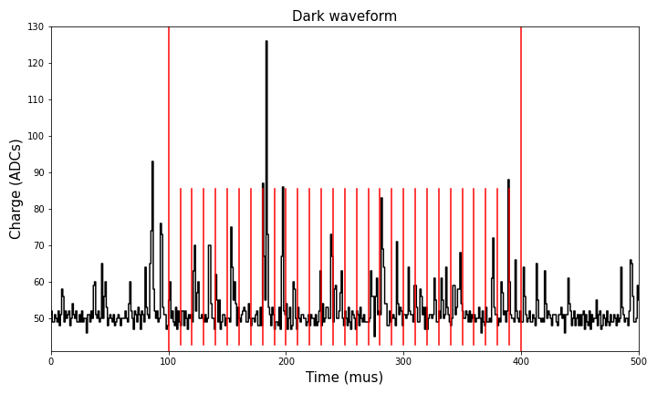

Berenice
==========

*From Βερενíκη, Ancient Macedonian form of the Attic Greek, Φερενíκη: she, who brings victory.*

This city produces the spectrum of dark noise of the SiPMs. This is achieved by binning either the :math:`pe` or :math:`ADC` content of each raw WF sample. Some slices will have only electronic noise while others will contain one or more dark counts. The resulting spectra give a representation of the SiPM charge in the absence of external light above detector ambient conditions.

.. _Berenice input:

Input
-----

 * ``/Run/events``: list of the ``evt_number`` and the correspondent ``timestamp``.
 * ``/Run/runInfo``: stores the ``run_number``.
 * ``/RD/sipmrwf``: stores the raw waveform itself. It indicates the number of :math:`ADCs` per time bin for each event and SiPM.

.. _Berenice output:

Output
------

 * ``HIST/median``: histogram values of the dark spectrum when the baseline substraction has been performed with the median of the waveform along with the :math:`ADCs` to :math:`pes` conversion (calibration).
 * ``HIST/median_bins``: bin values of the dark spectrum ``HIST/median``.
 * ``HIST/mode``: histogram values of the dark spectrum when the baseline substraction has been performed with the mode of the waveform along with the :math:`ADCs` to :math:`pes` conversion (calibration).
 * ``HIST/mode_bins``: bin values of the dark spectrum ``HIST/mode``.
 * ``HIST/adc``: histogram values of the dark spectrum when the baseline substraction has been performed with the mode of the waveform and no calibration.
 * ``HIST/adc_bins``: bin values of the dark spectrum ``HIST/adc_bins``.

.. _Berenice config:

Config
------

Besides the :ref:`Common arguments to every city`, *Berenice* has the following arguments:

.. list-table::
   :widths: 50 40 120
   :header-rows: 1

   * - **Parameter**
     - **Type**
     - **Description**

   * - ``min|max_bin``
     - ``float``
     - Lower/upper limit of the number of :math:`ADCs`` of the waveform to be considered for the spectrum.

   * - ``bin_width``
     - ``int``
     - Width of the bins for the spectrum.

.. _Berenice workflow:

Workflow
--------

Berenice performs the following operations to obtain the dark spectra:

 * :ref:`Subtract the baseline <Subtract the baseline>`
 * :ref:`Waveform calibration <Waveform calibration>`
 * :ref:`Waveform slicing <Waveform slicing>`
 * :ref:`Histogram the result <Histogram the result>`

.. _Subtract the baseline:

Subtract the baseline
:::::::::::::::::::::

Berenice has two options for the baseline substraction: using the median or the mode, analogously described in in :ref:`Baseline subtraction of SiPM waveforms` section of the :doc:`irene` documentation.

.. _Waveform calibration:

Waveform calibration
::::::::::::::::::::

In this step, the waveform in :math:`ADCs` in converted to photoelectrons (:math:`pes`). For this, the gains are loaded from the NEXT database.

This step is optional when subtracting the baseline using the mode of the waveform.

.. _Waveform slicing:

Waveform slicing
::::::::::::::::

According to the selected ``min_bin``, ``max_bin`` y ``bin_width`` configuration parameters the waveform will be sliced. An exaggerated slicing can be observed in the figure below with ``min_bin=100``, ``max_bin=400`` y ``bin_width=10``:

.. _Histogram the result:

Histogram the result
::::::::::::::::::::

For each slice performed on the waveform in the previous section, it sums all the :math:`ADCs` in each slice and adds an entry to the histogram. It repeats this for each waveform of the same sensor.
