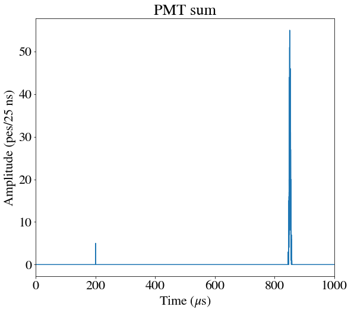
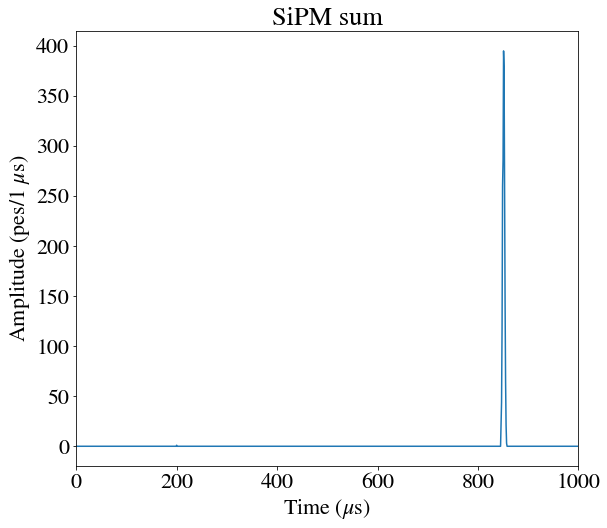
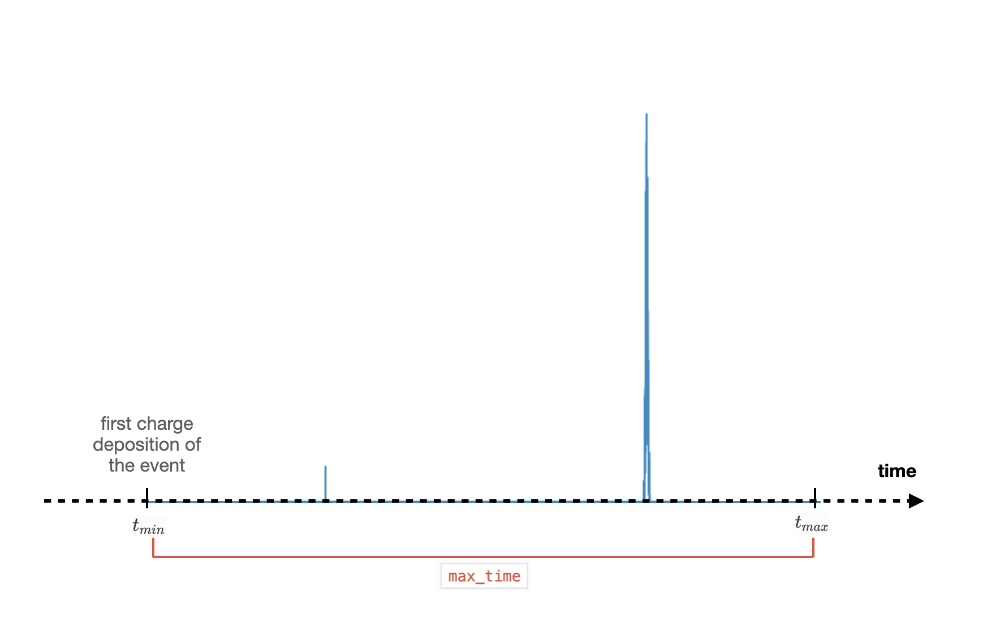
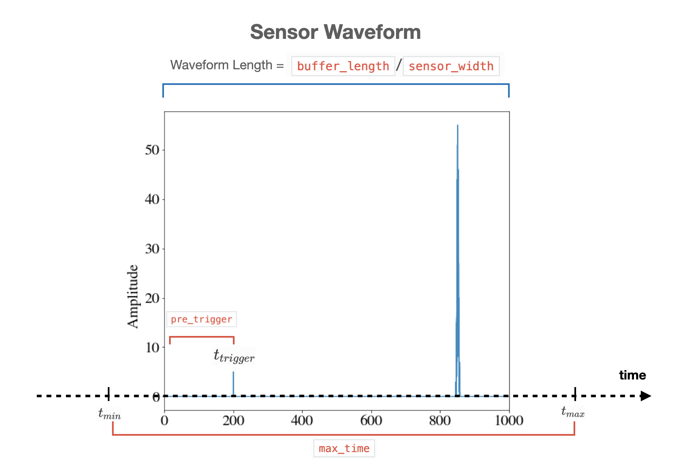

Buffy
=====

*Sorts MC sensors info into buffers, slays vampires, etc*

Full simulations generate sensor (PMTs and SiPMs) responses, including
the time and the detected charge of a specific signal. However, this
sensor information does not have the waveform format obtained from the
detector.  *Buffy* takes nexus sensors' information, and sorts it into
*true waveforms* (**TWF**).  **TWF**\ s represent the signal amplitude
of a given sensor without any type of distortion or effect from the
electronics within a certain time interval given by the sensor
sampling time.  This type of time ordering of the sensor signal in a
data-like format is what is called *bufferisation*.  **TWF**\ s
generated by *Buffy* can be transformed into *raw waveforms* **RWF**\
s (i.e. with effects from the electronics) with :doc:`diomira`. For
detector geometries without sensor electronics, a simplified
electronics modeling can be applied with :doc:`hypathia` to transform
**TWF**\ s directly into **PMap**\ s.

.. _Buffy input:

Input
-----

 * ``/MC/hits``: energy depositions in the "ACTIVE" and "BUFFER" volumes
 * ``/MC/particles``: particle tracking information
 * ``/MC/sns_response``: photon counts in photosensors

.. _Buffy output:

Output
------

 * ``/Run/runInfo``: run info table
 * ``/Run/events``: event info table
 * ``/Run/eventMap``: table that connects event id and nexus event numbering
 * ``/pmtrd``: time ordered signal amplitude of the PMTs in true
   photoelectrons (PMT buffers). array with shape: (number of events,
   number of PMTs, length of PMT waveform)
 * ``/sipmrd``: time ordered signal amplitude of the SiPMs in true
   photoelectrons (SiPM buffers). array with shape: (number of events,
   number of SiPMs, length of SiPM waveform).

.. _Buffy config:

Config
------

Besides the :ref:`Common arguments to every city`, *Buffy* has the following arguments:

.. list-table::
   :widths: 50 40 120
   :header-rows: 1

   * - **Parameter**
     - **Type**
     - **Description**

   * - ``max_time``
     - ``float``
     - Maximum duration of the event that will be taken into account
       starting from the first detected signal. All signals after that
       are lost. Must be greater than ``buffer_length``. If not,
       raises a warning and sets ``max_time`` == ``buffer_length``. It
       should be a multiple of 1 :math:`\mu s`.

   * - ``buffer_length``
     - ``float``
     - Configured buffer length in :math:`\mu s`.

   * - ``pre_trigger``
     - ``float``
     - Time in buffer before identified signal in :math:`\mu s`.

   * - ``trigger_threshold``
     - ``int``
     - Trigger threshold for selection in :math:`pe`\ s.

.. _Buffy workflow:

Workflow
--------
For full simulations, NEXUS ``/MC/sns_response`` table stores for each
event (``event_id``) the list of sensors (``sensor_id``) that detect a
specific number of photons (``charge``) in an ordered number of the
time bin (``time_bin``).

 .. image:: images/buffy/MC_sns_response_table.png
   :width: 300

More details about nexus output can be found in its `Github Wiki
<https://github.com/next-exp/nexus/wiki/Output-format>`_ . This type
of tables do not have the same shape that the waveforms collected when
data taken, and in addition they only provide the information from the
sensors and time bins when some charge is detected. Buffy takes this
information (``event_id``, ``sensor_id`` and ``time_bin``), and
transforms it into the waveform shape of the **TWF** expected for each
type of sensor: ``pmtrd`` and ``sipmtrd`` (PMTs and SiPMs
respectively) based on the *bufferisation* parameters
provided. Pictures below represent the output for PMTs and SiPMs
waveforms.

This process is separated in the following tasks in the city:

• :ref:`Histogram creation <Histogram>`
• :ref:`Signal Search <Signal-Search>`
• :ref:`Synchronisation and trigger separation <Trigg-Separation>`

Buffy output also includes ``/Run/runInfo`` and ``/Run/events`` tables
as the ones generated during data taking.

.. note::
   Historically, Buffy is based in an initial code of detsim
   (https://github.com/next-exp/IC/tree/master/invisible_cities/detsim)
   and most of its functions are located in that path but they are
   independent to :doc:`detsim` city.

.. _Histogram:

Histogram creation
::::::::::::::::::

As it was highlighted earlier, NEXUS information about sensor hits
(``/MC/sns_response``) comes binned in time based on when a sensor
sees some energy deposition.  This means that the ``time_bin`` column
numbers are increasing for a given event, but they can have gaps since
empty time bins are not stored. This initial part of the city checks
the time stamp of an event according to the sensors' response and
defines histograms of charge distribution between [:math:`t_{min}`,
:math:`t_{max}`], being:

• :math:`t_{min}`: the time stamp of the first charge deposition of the event,
• :math:`t_{max}`: defined considering that ``max_time`` =  :math:`t_{max}` - :math:`t_{min}`.

These histograms (one for PMTs and another for SiPMs) are defined by
summing all individual sensors. This step restores also empty bins by
padding zeros in between separate signals, and sample the histograms
according to the binning of each type of sensor (``pmt_width`` and
``sipm_width``). Sampling widths are included in the simulation
parameters (``/MC/configuration``), and depend on the type of sensor
and detector.  Normally correspond to 25 :math:`ns` for PMTs and and 1
:math:`\mu s` for SiPMs.

.. _Signal-Search:

Signal Search
:::::::::::::

Once the charge is distributed in the previously defined histograms,
the code searches for signal-like events.  It takes the PMT sum
histogram and looks for the first value of the binned charge above a
certain threshold (``trigger_threshold``), and defines the trigger
time, :math:`t_{trigger}`.  Waveforms are therefore defined for PMTs:

• shifting the times of the charge histogram such that the first value
  over threshold (:math:`t_{trigger}`) falls at the time defined as
  ``pre_trigger``;
• setting the length (in number of samples) as requested in the config
  parameters (``buffer_length``/``pmt_width``).

.. note::
  :math:`t_{min}` does not need to be at 0, since it is defined based
        on the first charge deposition, independently if it is above
        the ``trigger_threshold`` or not.

.. _Trigg-Separation:

Synchronisation and trigger separation
::::::::::::::::::::::::::::::::::::::

Since the buffer length is different for PMTs and SiPMs, it is
necessary to align and synchronise the signals between
waveforms. Waveforms are then sliced according to binning
(``pmt_width`` and ``sipm_width``), trigger time and configured
pre-trigger (``pre_trigger``).  Once PMT sum and SiPM sum waveforms
are synchronised, individual sensor waveforms are generated. If more
than one trigger is found separated from each other by more than a
buffer width, the nexus event can be split into multiple data-like
waveforms.
