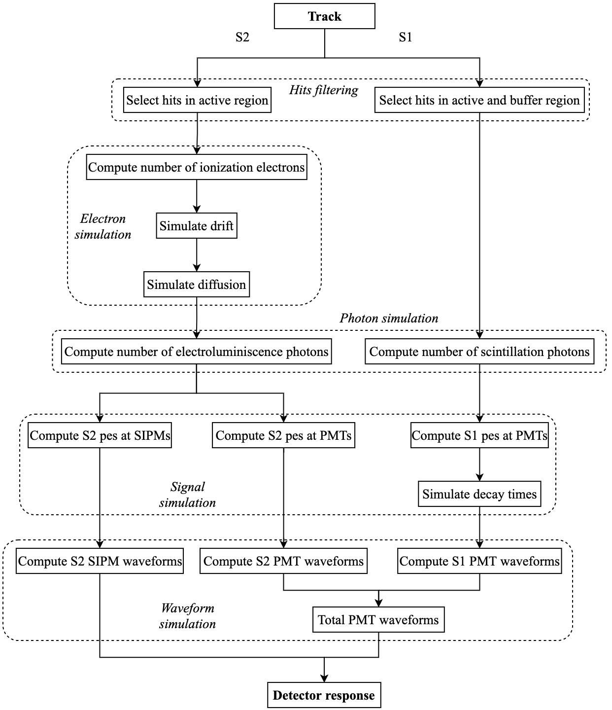

Detsim
==========

**Detsim**, from **Detector Simulation**, is a the city that simulates the *detector response* for *fast-simulated* events.
A *fast-simulated* event consist of a collection of hits of position and energy desposition in the gaseous volume (right figure below). The *detector response* are the signals measured in the light-sensors in the form of time ordered waveforms (left figure below).

We can differenciate two simulation modes implemented in NEXUS: the
full-simulation and the fast-simulation. In what follows, *primary
particles* are defined as the particles of the simulated event. The rest
of the particles produced in the simulation would be considered as
*secondary particles*. For example, :math:`0\nu\beta\beta` primary
particles are :math:`e^+ e^-`. Ionization electrons, scintillation
photons, and EL photons are secondary particles. The simulation modes
are described below.

**Full-Simulation:** In this mode the propagation of all particles
(primary and secondary) is carried out until they reach the sensors.
Particles are considered as individual entities with a unique ID-number,
making it possible to trace their interactions throughout the detector.
Therefore the overall simulation would be composed by the simulation of
each individual particle. This is a CPU-time-consuming task, growing
with the number of particles involved, which scales with the energy of
the simulated event. Since each of the emitted photons is also
simulated, the final result of the simulation will be a number of
photons arriving at the photo-sensors. The output of the simulation is
given as zero-suppressed time histograms with the photo-electrons
generated in each sensor (left figure). This simulation mode is
both CPU-time-consuming and memory demanding, with a time-scale on the
order of 2 min to simulate a 41.5 keV :math:`^{83m}`\ Kr event and > 1
hour for a :math:`Q_{\beta\beta} \sim 2.5` MeV event. The advantage of
this simulation mode is its extreme detail and that its outcome is the
actual signal measured at the light sensors.

**Fast-Simulation:** In this mode the simulation is stopped after the
creation of the ionization electrons and scintillation photons. The
ionization electrons and scintillation photons are produced by the
direct propagation of primary particles, or by secondary particles
emitted by the primaries, like delta electrons or bremsstrahlung that
subsequently interact. Once they are created, the simulation stops, and
neither drift nor light propagation is simulated. The ionization
electrons and scintillation photons created are collected in voxels of a
certain volume (usually around 1x1x1 mm\ :math:`^3` voxels). Each voxel
represents an energy deposition, a so-called *hit*, and is characterized
by a 3D position :math:`\boldsymbol{r} = (x, y, z)`, the energy
:math:`E` required to produce them, and the delay time :math:`t` from
the start of the event (right figure). The
collection of hits for a given even is saved, defining a *track* in the
detector’s active volume. The fast-simulation is very fast compared with
the full-simulation mode, on the :math:`\mu s` scale. However, since the
simulation is stopped we do not know the signal that would be measured
at the sensors.

.. _Detsim input:

Input
-----

Detsim input are NEXUS fast simulation tracks, these files must contain only the following non-empty information.

 * ``/MC/hits``

.. _Detsim output:

Output
------

 * ``/MC/``: the data in the nexus input file is copied in the output file
 * ``/Run/event_map``: mapping between nexus event id and IC event id. This mapping is needed because **detsim** might split nexus events into multiple IC events
 * ``/Run/events``: IC event number and simulated timestamps based on **rate** configuration parameter
 * ``/Run/runInfo``: run number of each event
 * ``/pmtrd``: the PMT waveforms for each PMT
 * ``/sipmrd``: the SiPM waveforms for each SiPM
 * ``/Filters/active_hits``: nexus events without hits inside the active volume are filtered

.. _Detsim config:

Config
------

.. container::
    :name: tab:detsim-parameters
    
    .. table:: List of **detsim** parameters used at each stage of the algorithm.

      =================== ==========================================
      \                   Parameter
      =================== ==========================================
      Electron simulation inverse ionization yield :math:`w_{io}`
      \                   fano-factor :math:`F`
      \                   drift velocity :math:`v_d`
      \                   lifetime :math:`\tau`
      \                   diffusion :math:`D_L`, :math:`D_T`
      Photon simulation   inverse scintillation yield :math:`w_{sc}`
      \                   EL gain :math:`G_{EL}`
      \                   conde-policarpo factor :math:`J_{CP}`
      Signal simulation   EL drift velocity :math:`v^{EL}_d`
      \                   S1 Light Tables
      \                   S2 Light Tables
      \                   point spread function (PSF)
      Waveform creation   pre-trigger time
      \                   buffer length
      \                   PMT waveforms bin width
      \                   SiPM waveforms bin width
      =================== ==========================================

Workflow
--------

The city flow parts are shown in the diagram

**Hits filtering**. Hit position determines in which region of the
detector the energy deposition occurs. Energy depositions, ie ionization
electrons, can only be created in the gaseous part of the detector which
is composed by the *active*, *buffer* and EL regions. The ionization
electrons drift towards the EL only if they are produced in the active
region, therefore only hits at this region are selected in the S2
simulation. On the other hand, scintillation photons can be emitted and
produce signal from anywhere inside the gas, thus the S1 simulation
keeps all the hits in the active and buffer regions. Hits in the
EL-region are removed to avoid duplication of S1 and S2 LTs and
implementation complications. This is a good approximation since the S1
of tracks with hits in the EL-region is overlapped with the subsequent
S2, and the event would be reconstructed anyway as an no-S1 event.

**Electron simulation**. This step starts by computing the ionization
electrons produced in each hit, which is the value of the hit energy
divided by the inverse ionization yield :math:`w_{io}`. Defining
:math:`n=E/w_{io}`, the number of ionization electrons in a hit
:math:`n'_{ie}` is simulated following the distribution

.. math::

   n'_{ie} \sim 
       \begin{cases} 
         \text{Pois}(n) & \text{if} ~ n F < 1 \\
         \text{Gauss}(\mu=n, \sigma=\sqrt{n F}) & \text{if} ~ n F \geq 1
      \end{cases},

motivated by the definition of the fano-factor :math:`F`. Next the
electrons are drifted toward the EL region. During the drifting some of
the electrons are absorbed due to impurity attachment, a process
described by an exponential with characteristic lifetime :math:`\tau`.
Or equivalently, the time it takes the drifting electrons to be absorbed
:math:`t_{abs}` is given by

.. math::

   t_{abs} \sim \text{Exp}(\lambda = \tau^{-1}).
       \label{eq:detsim-absorption-time}

Then the number of electrons that survive :math:`n_{ie}` can be computed
by

.. math::

   n_{ie} = \sum_{i=1}^{n'_{ie}} 
       \begin{cases}
           1 & \text{if} ~ t_{abs}^i < t_{drift} \\
           0 & \text{if} ~ t_{abs}^i \geq t_{drift}
       \end{cases},

where :math:`t_{drift}=z/v_{d}` is the time it takes to the ionization
electrons produced at :math:`z` to reach the gate with drift velocity in
the active volume :math:`v_d`. The last electron physical process to
simulate is the diffusion, characterized by the longitudinal and
transverse diffusion coefficients :math:`D_{L}` and :math:`D_{T}`
respectively. The position of each electron arriving at the gate is
diffused following

.. math::

   \begin{aligned}
       X_{diff}&\sim\text{Gauss}(x,~D_{T}\sqrt{z}),\\
       Y_{diff}&\sim\text{Gauss}(y,~D_{T}\sqrt{z}),\\
       Z_{diff}&\sim\text{Gauss}(z,~D_{L}\sqrt{z}).\end{aligned}

where :math:`x, y, z` are the initial position of the electrons, ie the
hit position in which they are created.

**Photon simulation**. The S1 photons are generated from the initial
hits through the inverse scintillation yield :math:`w_{sc}`

.. math:: n_{S1} \sim \text{Pois}(E/w_{sc})

The S2 photons are computed using the number of ionization electrons
arriving at the EL :math:`n_{ie}`,

.. math:: n_{S2} \sim\text{Gauss}\left(n_{ie}G_{EL}, \sqrt{n_{ie}G_{EL}J_{CP}}\right),

where :math:`G_{EL}` is the EL gain (number of photons emitted by a
single electron) and :math:`J_{CP}` is the conde-policarpo factor.

**Signal simulation**. In this stage we compute the photon-electrons
(pes) measured in each sensor and their arrival times. The treatment is
different for S1 and S2 signals and also for PMTs and SiPMs.

*S1*. In the photon simulation block, we computed the number of
scintillation photons produced by each hit. By the definition of the S1
LT, the number of photo-electrons generated by the scintillation photons
at :math:`x, y, z` is given by

.. math::

   S_{S1}(\text{PMT}) \sim \text{Pois}(n_{S1} \times \text{LT}_{S1}(x, y, z|\text{PMT})).
       \label{eq:poisson-S1}

The next step is to simulate the arrival time of the photons to the
sensors, which is given by

.. math::

   t_{arrival} = t + t_{decay} + t_{travel}
       \label{eq:s1-tarrival}

where :math:`t` is the hit production time, :math:`t_{decay}` the
scintillation decay time and :math:`t_{travel}` is the time it takes the
photons to go from the hit position to the particular PMT. The travel
time is neglected in detsim since its simulation would require a
complete photon propagation. The photon travel time is in fact
negligible compared to the drift time of the ionization electrons that
produce the S2, thus we can safely omit it (recall that S1 is used to
compute the drift time of the event, namely its longitudinal position).
The decay time is simulated for xenon using its fast and slow
scintillation components given by

.. math:: t_{decay} \sim 0.1 ~ \text{exp}(-t/\tau_{f}) + 0.9 ~ \text{exp}(-t/\tau_{s})

where :math:`\tau_{f} = 4.5~\text{ns}` and
:math:`\tau_{s} = 100~\text{ns}` are the fast and slow scintillation
decay times, respectively. For each measured photo-electron, a
:math:`t_{arrival}` is computed. The total S1 signal would be given by
the time histogram of the arrival times for the generated
photo-electrons. The S1 signal at the SiPMs is not simulated.

*S2*. The computation of the number of photo-electrons in the PMTs is
similar to that of the S1,

.. math:: S_{S2}(\text{PMT}) \sim \text{Pois}(n_{S2} \times \text{LT}_{S2}(x, y|\text{PMT})),

but the arrival times are treated differently. The arrival time will be
given by the sum of the production time, the drift time and the EL
emission time,

.. math:: t_{arrival} = t + t_{drift} + t_{EL}.

The drift time is given by :math:`t_{drift}=z/v_{d}`. The :math:`t_{EL}`
is the emission time at the EL gap. Assuming that photons are emitted
uniformly throughout the EL gap,

.. math:: t_{EL} \sim \text{Uniform} \left( 0, T_{EL} \right) \quad \text{with} \quad T_{EL}=\frac{w_{EL}}{v^{EL}_{d}},

where :math:`w_{EL}` is the width and :math:`v^{EL}_{d}` the drift
velocity in the EL. Notice that we are implicitly neglecting the travel
time from the emission point to the sensor, which is much lower that the
drift and EL times.

The signal in the SiPMs is computed with the PSF function. Recall that
the PSF is :math:`z` dependent, covering the EL width in several
partitions. For an ionization electron arriving at the EL at position
:math:`x, y` and emitting :math:`n_{S2}` total photons, the signal
produced at the SiPM at distance :math:`d` would be

.. math:: S_{S2}(\text{SiPM}, z_p) \sim \text{Pois} \left( n_{S2}/n_z \times \text{PSF} (d|z_{p}) \right),

where :math:`n_z` is the total number of EL partitions. Notice that this
is the signal produced by photons emitted at partition :math:`z_p`,
which are assumed to be uniformly emitted throughout the EL width. The
arrival times would also depend on the partition

.. math:: t_{arrival~p} = t + t_{drift} + t_{drift~p} + t_{EL~p}

where :math:`t_{drift~p} = |z_p|/v^{EL}_d` and

.. math:: t_{EL~p} \sim \text{Uniform} \left( 0, \Delta T_{p} \right) \quad \text{with} \quad \Delta T_{p}=\frac{w_{p}}{v^{EL}_{d}},

where :math:`w_p` is the partition width. Again, in both PMTs and SiPMs
the arrival time is computed for each measured photo-electron.

**Waveforms creation**. By definition, a waveform is a time histogram of
the arrival times. Therefore this step consists of histograming the
photo-electron’s arrival times for each sensor. The PMT and SiPM
waveforms are assumed to have the same *buffer-length* but different
*bin width*. By convention the waveform times go from 0 to
buffer-length, and in order to mimic the DAQ triggering system we add an
extra *pre-trigger buffer time* that fixes the start of the signals
inside the buffer.