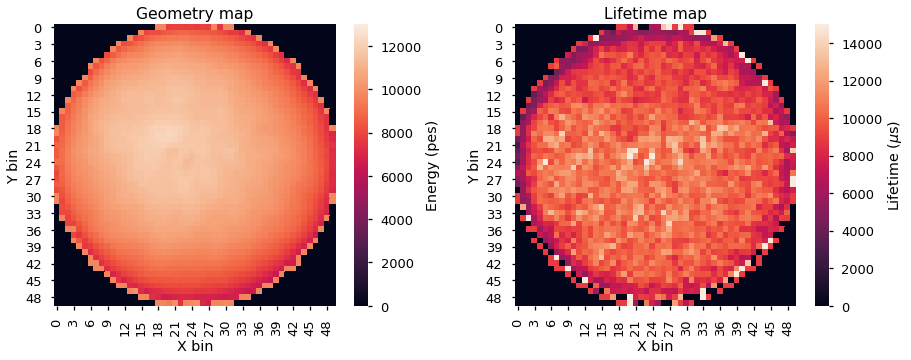
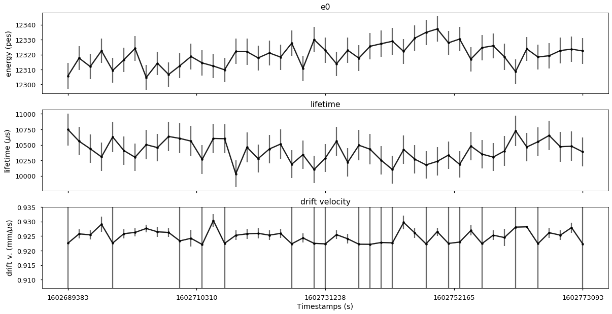
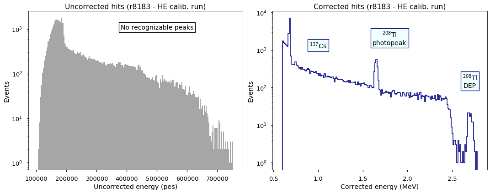
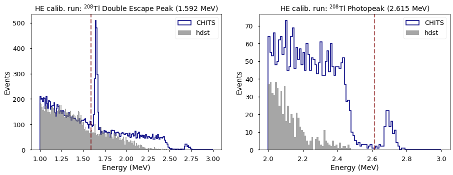

Esmeralda
=========

*From Spanish esmeralda (“emerald”), as first used in the novel Notre-Dame de Paris (1831) by Victor Hugo.*

At the moment of writing this, the city `Esmeralda` has three main purposes: **(i)** to apply a cut to remove the SiPM hits with charge below a certain threshold, **(ii)** the energy correction of the survivor hits using krypton maps (see :doc:`ICAROS`) and **(iii)** a first (and rough) computation of the topology-related information of events (analogous to :doc:`isaura`). Therefore, the position of the city within the NEXT reconstruction chain is precisely after :doc:`penthesilea`, since the input corresponds to the uncorrected hits stored in the ``/RECO/Events`` table of the **hdst** files. It is worth remarking here --in order to understand :ref:`Output <Esmeralda output>` and :ref:`Config <Esmeralda config>`-- that stages (i) and (ii) are performed two times inside the city for two different subsamples of the input dst. Thanks to that, the output is adapted to two different possible posterior analyses. This will be further discussed later on, along the :ref:`Workflow <Esmeralda workflow>` section.

.. _Esmeralda input:

Input
-----

 * ``/Run/events``
 * ``/Run/runInfo``
 * ``/RECO/Events``
 * ``/DST/Events``

.. _Esmeralda output:

Output
------

 * ``/CHITS/highTh``: energy-corrected hits table of the ones that pass the higher charge theshold selection.
 * ``/CHITS/lowTh``:  energy-corrected hits table of the ones that pass the lower charge theshold selection.
 * ``/Tracking/Tracks``: topological information of events. Each row corresponds to a different track, specified with the ``trackID`` among the other possible tracks within an event.
 * ``/Summary/Events``: global information related to the event. Each row is one event.
 * ``/DST/Events``: copy of the point-like information (**kdst**) events, which constitutes one of the output tables of :doc:`penthesilea`.
 * ``/Filters/high_th_select``: flag to indicate if an event passes the selection of having at least one hit with more charge than the ``threshold_charge_high`` parameter of the config file. 
 * ``/Filters/low_th_select``: flag to indicate if an event passes the selection of having at least one hit with more charge than ``threshold_charge_low``. 
 * ``/Filters/topology_select``: flag to indicate if an event passes the selection of having less (high-threshold) hits than ``max_num_hits``.
 * ``MC info``: copy of the Monte Carlo information for the events that the city outputs. Only if ``run_number`` < 0. The tables included are: ``/MC/configuration``, ``/MC/hits``, ``/MC/particles``, ``/MC/sns_positions``, and ``/MC/sns_response``.

.. _Esmeralda config:

Config
------

The `Esmeralda` configuration file share the :ref:`same common arguments <Common arguments to every city>` with the rest of the cities. In addition, there are two more dictionaries:

- ``cor_hits_params`` is in charge of the information related to steps (i) and (ii) commented in the introduction. Its parameters are:

.. list-table::
   :widths: 50 100 120
   :header-rows: 1

   * - **Parameter**
     - **Type**
     - **Description**

   * - ``map_fname``
     - ``string``
     - Name of the krypton correction map to use.

   * - ``threshold_charge_low``
     - ``float``
     - Lower threshold (in ``pes``) applied to the charge of hits.

       The energy of the non-selected hits is transferred to the closest one (that passes the selection). 

   * - ``threshold_charge_high``
     - ``float``
     - Similar to ``threshold_charge_low``, but using a higher charge threshold.

   * - ``same_peak``
     - ``bool``
     - If *True*, the energy of the hits with undefined (``NaN``) charge is assigned to other hits belonging to the **same** peak.

   * - ``apply_temp``
     - ``bool``
     - If *True*, temporal corrections are applied during the energy-correction procedure.

       It must be set to *False* if:

       (1) no temporal correction dataframe exists in map file

       (2) the input is MC (events are not provided with timestamp variable).

- On the other hand, ``paolina_params`` handle the processes associated to step (iii):

       
.. list-table::
   :widths: 50 100 120
   :header-rows: 1

   * - **Parameter**
     - **Type**
     - **Description**

   * - ``vox_size``
     - ``[float,float,float]``
     - X, Y, and Z dimensions of the voxels used in the voxelization of the hits.

   * - ``strict_vox_size``
     - ``bool``
     - Flag to indicate if the size of the voxels is forced to be exactly the values provided in the previous argument (*True*),

       or, on the other hand, if they are allowed to change a bit for each track, aiming to optimize the voxelization process (*False*).

   * - ``energy_threshold``
     - ``float``
     - If the energy of one of the original end-point voxels is smaller than this value,

       the voxel is dropped and its energy redistributed to the neighbours.

   * - ``min_voxels``
     - ``int``
     - The voxel dropping procedure commented on ``energy_threshold`` can only happen if the number of voxels is larger than the value specified in this argument.

   * - ``blob_radius``
     - ``float``
     - Radius of the blobs.

   * - ``max_num_hits``
     - ``int``
     - Maximum number of hits for an event to be processed.

       Events with more hits are filtered out and their ID will not appear in the ``Filters/topology_select`` table of the output.

.. _Esmeralda workflow:

Workflow
--------

Since its creation, *Esmeralda* has been a sort of a *Frankenstein*'s monster, seeing that it contains two main parts of code that are uncorrelated. They are planned to be decoupled at some point, but in the meantime both of them will be performed here:

 * :ref:`Correction of SiPM-based hits <Correction of SiPM-based hits>`
 * :ref:`Topology information extraction <Topology information extraction>`

.. _Correction of SiPM-based hits:

Correction of SiPM-based hits
:::::::::::::::::::::::::::::

The **hits** (also known as *clusters*) that constitute the input for this city are the ones coming from :doc:`penthesilea` --inside the table ``RECO/Events``--. They are energy depositions separated in time slices  [#]_ of 2 :math:`\mu s` provided with a given *X* and *Y* position in the chamber, according to the pattern of signals observed on the SiPMs. Therefore, these energy depositions combine the light collected by both the SiPMs (tipically called "*charge*" and stored in the dst as ``Q``) and the PMTs ("*energy*" --``E`` variable-- for us) [#]_. Due to the fact that PMTs sentitivity is better than the one of SiPMs, there might be some time slices in the PMTs waveform that do not appear in the SiPMs one. In these cases, the charge of the correspondent hits is set to ``NaN`` and their position at the *XY* plane to: ``X = Y = 0``.

Once the main features of the input dst are explained, let's describe the different algorithms included in the first part of the city. The first thing to do consists in applying a cut on the charge of hits in order to remove the ones with low charge, aiming to obtain a "cleaner" version of the event, what will allow us to perform a better reconstruction for the posterior analysis. Therefore, if one hit does not pass the charge threshold (``threshold_charge_low`` or ``threshold_charge_high``, depending on the case), its energy is charged-weighted redistributed between those one that do pass the cut and belong to the same time slice. After that, the hit will be removed from the dst. In case none of the hits for a given slice is above the threshold, a new hit containing all the redistributed energy is created at the same *Z* coordinate position, with: ``Q = NaN`` and ``X = Y = 0``.

At this point --and as a consequence of either the previous step or the `Penthesilea` algorithm itself--, the dst may include time slices with undefined charge (although defined energy). This issue is now addressed by redistributing their energy among the closest hits along the *Z*-axis, and that comprise the same ``npeak`` (S2 peak) if ``same_peak = True``. This energy sharing is proportional to the energy of the "good" hits. If all hits within a peak are ``NaN``, the S2 would be reconstructed as being empty.

.. _Applying corrections:

**Applying corrections**

Once all the hits for the analysis has been selected and are well-defined (with a proper ``E``, ``X``, ``Y`` and ``DT``), it is time to correct them using the krypton-based map generated in :doc:`ICAROS`. Its name will be specified with ``map_fname`` in the configuration file.

Thanks to the **dual trigger scheme** exploited by the experiment, we are capable of taking low-energy krypton runs simultaneously to the usual high-energy data. This allows us to monitor the status of the chamber in every moment and to obtain a correction map specific for every run (providing a very robust tool, that avoids possible temporal discrepancies in case the krypton run and the physics run would have been taken at different moments).  

The first step comprises the energy correction of the hits. As it is well-known, there are two effects that degrade the real energy of events that must be taken into account:

 - The **attachment** of drift electrons during their way to the anode. It is corrected using the *lifetime* map, stored in the ``lt`` table of the ``map_fname``.

 - The **XY non-homogeneities** in the light collection by the PMTs. This time, the *geometry*  (``e0``) map will be applied.

An example of these correction maps can be seen below (left: geometry map, right: lifetime map), for a NEXT-White high-energy calibration run [#]_ (namely run 8183, taken just before Run-VI). 

In NEXT-White, the XY pattern distributions at both krypton maps were demonstrated to remain stable during the extensive data-taking devoted to the double-beta analysis. Nevertheless, their mean value does variate in time, due to the improvement in the purity of the gas inside the chamber, for example, thanks to its recirculation. This temporal variations are exemplified in the plots below, where the evolution of lifetime, energy scale (e0) and drift-velocity are represented for the same high-energy calibration run as before. 

If the ``apply_temp`` parameter is set to *True*, these variations will be considered for the correction. On the contrary, this variable must be set to *False* in case the map does not include this temporal information table, or the city is run over MC files (whose events do not have a timestamp variable either).

The following image shows the clear improvement on the energy spectrum after applying all the corrections explained above:  

|
|

.. warning::
 Despite the energy correction explained just before, there are **two** important factors that make the previous calibration not ultimate. They are not going to be explained in detail here, seeing that these further corrections are not applied along `Esmeralda`. However, since they are not applied inside any other city either and the energy modification of events is performed here, it is justified to comment them now.              

1. **Non-linearities at high energies**. Due to the signicant difference between the krypton energy scale and the one of the physics data (above 1 MeV), the Kr-based energy correction might **not be sufficient** for all the energy range considered. Therefore, although krypton maps were applied, it is advisable to check the high energy peaks, so as to account for observed **non-linearities** and obtain the proper calibration. The plots below show clearly how the high energy 208-Thallium gamma lines (nominal values are illustrated with dashed red lines) are not aligned perfectly in spite of the maps corrections.

*Note:* the energy scale of the uncorrected hits coming from the hdst presented in the plots above has only illustrative pruposes (to compare both distributions). Its conversion between pes to MeV was made considering in an approximate way the number of pes yielded by krypton events.

2. **The axial length (Z-width) effect**. There is an additional final energy correction that must be applied in the analysis post-reconstruction: the so-colled *Z-width effect* correction. Detailed information about possible explanations for this phenomenon, as well as an empirical procedure to deal with it can be found `here <https://arxiv.org/abs/1905.13110>`_.

Apart from the energy correction, the position of hits along the drift time (``DT`` variable in the dst) of the chamber is also transformed to its equivalent in the **Z-axis** [#]_. To do that, drift time values are simply multiplied by the *drift-velocity*. In data, this magnitude is computed as a funtion of time, so this conversion can be also time-dependent if ``apply_temp`` is *True*.

..
 It is relevant to remark here that the aforementioned processes explained through :ref:`this section <Correction of SiPM-based hits>` are performed **two** times for all events every time the city is run. There are two different high-level analysis performed by the experiment, and each of them requires different types of inputs:

|
|
 At this point, and once all the correction process (made inside `Esmeralda`) is explained, it is relevant to remark that there are several possible high-level analysis to be conducted posterior to this city. Each of them require a different treatment of its input, being that the reason why all the processes commented before are performed **two** times for all events every time the city is run.

 - The current *official* reconstruction (that will run :doc:`beersheba` after this) and the DNN analysis are interested in keeping also some lower charged hits (all the ones above **5-10 pes**, typically). This is due to the fact that both analysis will carry out additional manipulations to the data, and in consequence, they ought to keep more information of events. In these cases, the lifetime inside `Esmeralda` of the energy corrected hits that passed the ``threshold_charge_low`` threshold will end here. They will be stored in the ``CHITS/lowTh`` table of the output, and their IDs in ``Filters/low_th_select``.

 - On the other hand, the "classical" [#]_ analysis performs all the tracking algorithms directly over these "high-pitched" (in comparison to the deconvoluted ones, out of :doc:`beersheba`) SiPMs hits. In this case, the :ref:`Paolina <Topology information extraction>` algorithm, which is described as follows, will correpond to the latest step of the data processing for them. It was demonstrated that in order to obtain a clearer track and perform a more accurate tracking reconstruction, a sharper (around **30-35** pes, specified in ``threshold_charge_high``) charge threshold cut is desired. The resulting hits will appear in the table ``CHITS/hightTh`` and their IDs in ``Filters/high_th_select``.

   

.. _Topology information extraction:

Topology information extraction
:::::::::::::::::::::::::::::::

As it has been stated, the hits with sufficient charge to pass the high-threshold cut go through the `Paolina` algorithm in order to extract all the topological information. This procedure is also performed inside a posterior city, :doc:`isaura`. Thus, a detailed description of it can be found in the correspondent documentation section. The parameters to run this stage of the reconstruction chain are the ones specified with the ``paolina_params`` dictionary.  Due to the fact that the distribution of the hits obtained at this point is much looser than the ones of deconvoluted hits, the config parameters for the voxel size and blob radius are in general significantly larger than the ones used in :doc:`isaura`. In order to illustrate this comparison, :ref:`this same event <Isaura display>` is displayed below, after a typical `Esmeralda` topological reconstruction:

 .. image:: images/esmeralda/r8250_evt194237_chits_esmeralda.png
   :width: 50.2%
 .. image:: images/esmeralda/r8250_evt194237_voxels_esmeralda.png
   :width: 48.5%

The left panel displays the 3D distribution of the ``CHITS/highTh`` hits, while the right one corresponds to its [15, 15, 15] :math:`{\text{mm}}^3` voxelized track, according to the algorithm. It is straightforward to realize that the result of this reconstruction is much more naive than the one obtained after running the full processing chain that includes the deconvolution.

The city concludes storing all the information commented before in different tables of a unique hdf5 file, as described in the :ref:`Output <Esmeralda output>` subsection.

 .. [#] That are directly proportional to the postion ``Z`` in the *Z*-axis. The conversion from drift time (``DT``) to ``Z`` will be briefly commented later on.

 .. [#]  As a convention, when we talk about the total energy of one event it is referred to: :math:`E_{tot} = \sum_{i}^{n_{hits}} E_{i}`.

 .. [#]  These high-energy calibration runs are those ones taken with the outer castle closed, but placing some sources of :math:`{}^{137}Cs` and :math:`{}^{208}Th` on different ports around the detector. More details about these runs can be checked in: `<https://arxiv.org/abs/1905.13110>`_.
         
 .. [#]  There is already a variable called ``Z`` in the ``RECO/Events`` table of the ``hdst``. However, that was only a convention, seeing as at that point the value for the  *drift-velocity* during the run has not been computed yet.

 .. [#]  This analysis was the official one until :doc:`beersheba` was introduced into the reconstruction chain, which improved significantly the results.

