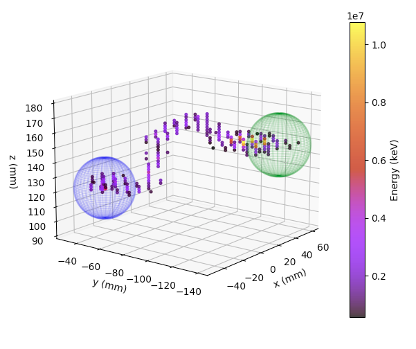

Esmeralda
=========

*From Spanish esmeralda (“emerald”), as first used in the novel Notre-Dame de Paris (1831) by Victor Hugo.*

The city of `Esmeralda` has two main purposes:

 **1.** The  manipulation of the *SiPM hits* to obtain better defined tracks, which includes:

      **1.a)** a cleaning procedure that removes the hits with a *charge* (light measured by the SiPMs) below a certain threshold,

      **1.b)** the energy correction of the survivor hits using krypton maps (see :doc:`ICAROS`).

 **2.** A first computation of the topology-related information of events using some of these corrected SiPM hits.

The position of the city within the NEXT reconstruction chain is after :doc:`penthesilea`. Thus, the input corresponds to the uncorrected hits stored in the ``/RECO/Events`` table of the **hdst** files. It is worth remarking here --in order to understand :ref:`Output <Esmeralda output>` and :ref:`Config <Esmeralda config>`-- that stages **1.a)** and **1.b)** are performed two times inside the city for two different subsamples of the input dst. In consequence, the output will be able to be adapted to two possible posterior analyses.

.. _Esmeralda input:

Input
-----

 * ``/Run/events``
 * ``/Run/runInfo``
 * ``/RECO/Events``
 * ``/DST/Events``

.. _Esmeralda output:

Output
------

 * ``/CHITS/highTh``: energy-corrected hits table of the ones that pass the higher charge threshold selection. 17 columns that include: event ID, timestamp, charge, uncorrected energy (``E``, :math:`\text{pes}`), corrected energy (``Ec``, :math:`\text{MeV}`), and *X*, *Y*, *Z* positions (:math:`\text{mm}`) for each hit.
 * ``/CHITS/lowTh``:  energy-corrected hits table (similar to the previous one) of the ones that pass the lower charge threshold selection.
 * ``/Tracking/Tracks``: topological information of events. Each row corresponds to a different track, specified with the ``trackID`` among the other possible tracks within an event, and also includes: its energy, length, number of voxels and their size, number of hits, minimum, maximum and average *XYZ* positions, position of the extreme voxels, position and energy of the blobs, amount of energy shared by both blobs, and number of tracks that comprise the event.
 * ``/Summary/Events``: global information related to the event. Each row is one event. It contains: event ID, minimum, maximum and average *XYZ* and *R* positions, event energy, charge, number of tracks, number of hits, and a flag that indicates if the event includes hits outside the correction map.
 * ``/DST/Events``: copy of the point-like information (**kdst**) events, which constitutes one of the output tables of :doc:`penthesilea`.
 * ``/Filters/high_th_select``: flag to indicate if an event passes the selection of having at least one hit with more charge than the ``threshold_charge_high`` parameter of the config file.
 * ``/Filters/low_th_select``: flag to indicate if an event passes the selection of having at least one hit with more charge than ``threshold_charge_low``.
 * ``/Filters/topology_select``: flag to indicate if an event passes the selection of having fewer (high-threshold) hits than ``max_num_hits``.
 * ``MC info``: copy of the Monte Carlo information for the events that the city outputs. Only if ``run_number`` < 0. The tables included are: ``/MC/configuration``, ``/MC/hits``, ``/MC/particles``, ``/MC/sns_positions``, and ``/MC/sns_response``.

.. _Esmeralda config:

Config
------

The `Esmeralda` configuration file shares the :ref:`same common arguments <Common arguments to every city>` with the rest of the cities. In addition, there are two more dictionaries:

- ``cor_hits_params`` is in charge of the information related to the step **1)** commented in the introduction. Its parameters are:

.. list-table::
   :widths: 60 40 120
   :header-rows: 1

   * - **Parameter**
     - **Type**
     - **Description**

   * - ``map_fname``
     - ``string``
     - Name of the correction map, computed with the Kr-calibration data, used to correct geometry, lifetime, and, if possible, temporal variations.

       In general, the maps used are computed with the Krypton events taken at the same time as the high energy ones manipulated here.

   * - ``threshold_charge_low``
     - ``float``
     - Lower threshold (in :math:`\text{pes}`) applied to the charge of hits.

   * - ``threshold_charge_high``
     - ``float``
     - Similar to ``threshold_charge_low``, but using a higher charge threshold.

   * - ``same_peak``
     - ``bool``
     - If *True*, the energy of the hits with undefined (``NaN``) charge is assigned to other hits belonging to the **same** S2 peak.

   * - ``apply_temp``
     - ``bool``
     - If *True*, temporal variations of lifetime and energy scale are considered during the energy-correction procedure.

       It must be set to *False* if:

       (1) no temporal correction dataframe exists in the map file

       (2) the input is MC (events are not provided with timestamp variable).

- On the other hand, ``paolina_params`` handles the processes associated with step **2)**:

.. list-table::
   :widths: 50 40 120
   :header-rows: 1

   * - **Parameter**
     - **Type**
     - **Description**

   * - ``vox_size``
     - ``[float,float,float]``
     - X, Y, and Z dimensions (in :math:`\text{mm}` each one) of the voxels used in the voxelization of the hits.

   * - ``strict_vox_size``
     - ``bool``
     - If *True*: the voxels size is forced to be exactly the values provided in the previous argument.

       If *False*: the dimensions are allowed to change a bit for each track, aiming to optimize the voxelization process.

   * - ``energy_threshold``
     - ``float``
     - If the energy (in :math:`\text{MeV}`) of one of the original extreme voxels is smaller than this value,

       the voxel is dropped and its energy redistributed to the neighbours.

   * - ``min_voxels``
     - ``int``
     - Minimum number of voxels to perform the dropping algorithm commented on ``energy_threshold``.

   * - ``blob_radius``
     - ``float``
     - Radius of the blobs in :math:`\text{mm}`. Click :ref:`here <Blobs position>` to know more about the position from where this radius is taken.

   * - ``max_num_hits``
     - ``int``
     - Maximum number of hits for an event to be processed.

       Events with more hits are filtered out and their ID will not appear in the ``Filters/topology_select`` table of the output.

.. _Esmeralda workflow:

Workflow
--------

In its current configuration, *Esmeralda* runs two main algorithms. First, it selects hits in two groups, depending if they pass a low or a high energy threshold on the SiPM signal, and calibrates them using the Kr correction maps. After that, the *Paolina* algorithm is run over the high-threshold passing hits to create 3D voxel-made tracks and compute the topology information.

 #. :ref:`Manipulation of the SiPM-based hits <Manipulation of SiPM-based hits>`

    * :ref:`Energy reassignment <Energy reassignment>`
    * :ref:`Energy calibration <Energy calibration>`

 #. :ref:`Topology information extraction of events <Topology information extraction>`

.. _Manipulation of SiPM-based hits:

Manipulation of the SiPM-based hits
:::::::::::::::::::::::::::::::::::

The **hits** (also known as *clusters*) that constitute the input for this city are the ones coming from :doc:`penthesilea` --inside the table ``RECO/Events``--. They are energy depositions separated in time slices  [#]_ of 2 :math:`\mu s` provided with a given *X* and *Y* position in the chamber, according to the pattern of signals observed on the SiPMs. Therefore, these energy depositions combine the light collected by both the SiPMs (typically called "*charge*" and stored in the dst as ``Q``) and the PMTs ("*energy*" --``E`` variable-- for us) [#]_. Due to the fact that PMTs sensitivity is better than the one of SiPMs, there might be some time slices in the PMTs waveform that do not appear in the SiPMs one. In these cases, a hit is created at the corresponding position along the DT-axis, with a charge set to ``NaN`` and  ``X = Y = 0``.

Apart from that, it is relevant to remind that the energy ``E`` of the input hits cannot be used directly in the high-level analysis because of two reasons:

 #. Its units are :math:`\text{pes}` (thanks to the *ADC-to-pes* conversion of the PMT waveforms performed in :doc:`irene`), requiring the conversion to :math:`\text{eV}`.
 #. It must be corrected due to different processes that degrade the light collection.

With all the information presented above, one could realize that the SiPM-based hits that enter the city must suffer some modifications in order to be useful for the later analysis. The explanation of these processes is the main purpose of this section.

.. _Energy reassignment:

**Reassignment of the hits energy**

The first thing to do consists in applying a cut on the charge of hits in order to remove those ones with a non-defined (``NaN``) or a very low value, aiming to obtain a "cleaner" version of the event, which will allow performing a better reconstruction in the posterior analysis. Therefore, if one hit does not pass the charge threshold (``threshold_charge_low`` or ``threshold_charge_high``, depending on the case), its energy is charged-weighted and redistributed between those ones that do pass the cut and belong to the same time slice. After that, the hit will be removed from the dst. In case none of the hits for a given slice is above the threshold, a new hit containing all the redistributed energy is created at the same *Z* coordinate position, with ``Q = NaN`` and ``X = Y = 0``.

At this point, the dst may include time slices with an undefined charge but defined energy, as a result of the previous step. This issue is now addressed by redistributing their energy among the closest hits along the *Z*-axis and, if ``same_peak`` is *True*, that comprise the same ``npeak`` (S2 peak). Among the hits belonging to the closest slice, this energy allocation is performed proportionally to their hit energy. If all hits within a peak are ``NaN``, the S2 would be reconstructed as being empty.

.. _Energy calibration:

**Calibration of the hits energy**

The selected hits are now calibrated using the krypton map generated in :doc:`ICAROS` and specified in ``map_fname`` to convert the energy, ``E``, from :math:`\text{pes}` into :math:`\text{eV}`, and the *Z* position, ``Z``, from :math:`\mu \text{s}` to :math:`\text{mm}`.

Thanks to the **dual trigger scheme** exploited by the experiment, low-energy krypton runs are taken simultaneously to the usual high-energy data. This allows monitoring the status of the chamber at every moment and obtaining a correction map specific for every run (providing a very robust tool, that avoids possible temporal discrepancies in case the krypton run and the physics run would have been taken at different moments).

The first step comprises the energy correction of the hits. As it is well-known, there are two effects that degrade the real energy of events that must be taken into account:

 - The **attachment** of drift electrons during their way to the anode. It is corrected using the *lifetime* map, stored in the ``lt`` table of the ``map_fname``.

 - The **XY non-homogeneities** in the light collection by the PMTs. This time, the *geometry*  (``e0``) map will be applied.

An example of these correction maps can be seen below (left: geometry map, right: lifetime map), for a NEXT-White high-energy calibration run [#]_ (namely run 8183, taken just before Run-VI).

.. image:: images/esmeralda/maps_r8183.png
   :width: 900
   :align: center

In NEXT-White, the XY pattern distributions at both krypton maps were demonstrated to remain stable during the extensive data-taking period devoted to the double-beta analysis. Nevertheless, their mean value did variate with time, due to the improvement in the purity of the gas inside the chamber, for example, thanks to its recirculation. These temporal variations are exemplified in the plots below, where the evolution of lifetime, energy scale (e0), and drift velocity are represented for the same high-energy calibration run as before.

.. image:: images/esmeralda/maps_temporal_evolution.png
   :width: 900
   :align: center

If the ``apply_temp`` parameter is *True*, these variations will be considered for the correction. On the contrary, this variable must be set to *False* in case the map does not include this temporal information table, or the city is run over MC files (whose events do not have a timestamp variable either).

The following image shows the clear improvement in the energy spectrum after applying all the corrections explained above:

.. image:: images/esmeralda/energy_spectrum_corr_vs_uncorr.png
   :width: 900
   :align: center

|

It is important to remark that notwithstanding the energy correction of the hits commented on above, the total energy of high-energy spatial-extended events needs to be ultimately corrected after the whole IC reconstruction chain is performed. More information concerning these further corrections is presented in the :ref:`Appendix <final_energy_correction>`.

Apart from the energy correction, the position of hits along the drift time (``DT`` variable in the dst) of the chamber is also transformed to its equivalent in the **Z-axis** [#]_. To do that, drift time values are simply multiplied by the *drift velocity*. In data, this magnitude is computed as a function of time, so this conversion can also be time-dependent if ``apply_temp`` is *True*.

.. note::
 At this point, and once all the correction process (made inside `Esmeralda`) is explained, it is relevant to remark that there are several possible high-level analyses to be conducted posterior to this city. Each of them requires a different treatment of its input, being that the reason why all the processes commented before are performed **two** times for all events every time the city is run.

 - The current *official* reconstruction (that will run :doc:`beersheba` after this) and the DNN analyses are also interested in keeping some lower charged hits (all the ones above **5-10 pes**, typically). This is due to the fact that both analyses will carry out additional manipulations to the data, and in consequence, they ought to keep more information about events. In these cases, the lifetime inside `Esmeralda` of the energy-corrected hits that passed the ``threshold_charge_low`` threshold will end here. They will be stored in the ``CHITS/lowTh`` table of the output, as indicated in ``Filters/low_th_select``.

 - On the other hand, the "classical" [#]_ analysis performs all the tracking algorithms directly over these "high-pitched" (in comparison to the deconvoluted ones, out of :doc:`beersheba`) SiPMs hits. In this case, the :ref:`Paolina <Topology information extraction>` algorithm, which is described as follows, will correspond to the latest step of the data processing for them. It was demonstrated that in order to obtain a clearer track and perform a more accurate tracking reconstruction, a sharper (around **30-35** pes, specified in ``threshold_charge_high``) charge threshold cut is desired. The resulting hits will appear in the table ``CHITS/highTh``, according to ``Filters/high_th_select``.

.. _Topology information extraction:

Topology information extraction
:::::::::::::::::::::::::::::::

As it has been stated, the hits with sufficient charge to pass the high-threshold cut go through the `Paolina` algorithm in order to extract all the topological information. This procedure is also performed inside a posterior city, :doc:`isaura`. Thus, a detailed description of it can be found in the corresponding documentation section. As a summary, the algorithm is constituted by the following steps:

 - The high threshold hits are converted into voxels of sizes given by the ``vox_size`` parameter, typically [15 x 15 x 15] :math:`\text{mm}^3`.

 - A graph module is used to compute the longest of the minimum spanning trees that can be computed with any pair of voxels, providing *tracks*.

 - The two end-points of each track are found according to :ref:`this procedure <Blobs position>`. From there, the energy of the blobs is computed using the hits inside a sphere of radius ``blob_radius``.

The parameters to run this stage of the reconstruction chain are the ones specified with the ``paolina_params`` dictionary.  Due to the fact that the distribution of the hits obtained at this point is much looser than the ones of deconvoluted hits, the config parameters for the voxel size and blob radius are in general significantly larger than the ones used in :doc:`isaura`. In order to illustrate this comparison, :ref:`this same event <Isaura display>` is displayed below, after a typical `Esmeralda` topological reconstruction:

 .. image:: images/esmeralda/r8250_evt194237_chits_esmeralda.png
   :width: 50.2%
 .. image:: images/esmeralda/r8250_evt194237_voxels_esmeralda.png
   :width: 48.5%

The left panel displays the 3D distribution of the ``CHITS/highTh`` hits, while the right one corresponds to its [15, 15, 15] :math:`{\text{mm}}^3` voxelized track, according to the algorithm. It is straightforward to realize that the result of this reconstruction is much more naive than the one obtained after running the full processing chain that includes :doc:`beersheba`. The resulting 21-:math:`{\text{mm}}`-radius blobs are displayed in the figure below, where the green sphere corresponds to the most energetic one (eblob = 335 :math:`\text{keV}`, for this particular event) while the blue sphere to the less energetic blob (118 :math:`\text{keV}`):

Once the blobs are computed for the high threshold hits, the city concludes by storing  all the information obtained during the city in different tables of a unique hdf5 file. As described in the :ref:`Output <Esmeralda output>` subsection, the general information of the event is stored in ``Summary/Events``, the topology information related to the tracks in ``Tracking/Tracks``, and the corrected hits in the corresponding ``CHITS`` table, depending on the threshold they passed.

|
|

.. _final_energy_correction:

Appendix: Post IC reconstruction energy correction
::::::::::::::::::::::::::::::::::::::::::::::::::

In addition to the hit energy calibration explained :ref:`before <Energy calibration>`, there are **two** important factors that make the previous calibration not ultimate. They are not going to be explained in detail here because these further corrections are not applied along `Esmeralda`. However, since they are not applied inside any other city either and the energy modification of events is performed here, it is justified to comment on them now.

1. **Non-linearities at high energies**. Due to the significant difference between the krypton energy scale and the one of the physics data (above 1 MeV), the Kr-based energy correction might **not be sufficient** for all the energy range considered. Therefore, although krypton maps were applied, it is advisable to check the high energy peaks, so as to account for observed **non-linearities** and obtain the proper calibration. The plots below show clearly how the high energy 208-Thallium gamma lines (nominal values are illustrated with dashed red lines) are not aligned perfectly in spite of the maps corrections.

.. image:: images/esmeralda/energy_spectrum_corr_vs_uncorr_PEAKS.png
   :width: 900
   :align: center

*Note:* the energy scale of the uncorrected hits coming from the hdst presented in the plots above has only illustrative purposes (to compare both distributions). Its conversion between pes to MeV was made considering in an approximate way the number of pes yielded by krypton events.

2. **The axial length (Z-width) effect**. There is an additional final energy correction that must be applied in the analysis post-reconstruction: the so-called *Z-width effect* correction. Detailed information about possible explanations for this phenomenon, as well as an empirical procedure to deal with it can be found `here <https://inspirehep.net/literature/1737564>`_.

|

 .. [#] That are directly proportional to the postion ``Z`` in the *Z*-axis. The conversion from drift time (``DT``) to ``Z`` will be briefly commented later on.

 .. [#]  As a convention, when we talk about the total energy of one event it is referred to: :math:`E_{tot} = \sum_{i}^{n_{hits}} E_{i}`.

 .. [#]  These high-energy calibration runs are those taken with the outer castle closed, but placing some sources of :math:`{}^{137}Cs` and :math:`{}^{208}Th` on different ports around the detector. More details about these runs can be checked in: `<https://inspirehep.net/literature/1737564>`_.

 .. [#]  There is already a variable called ``Z`` in the ``RECO/Events`` table of the ``hdst``. However, that was only a convention, seeing as at that point the value for the  *drift-velocity* during the run has not been computed yet.

 .. [#]  This analysis was the official one until :doc:`beersheba` was introduced into the reconstruction chain, which improved significantly the results.
