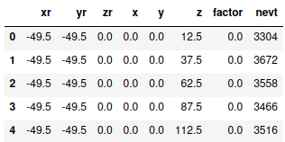
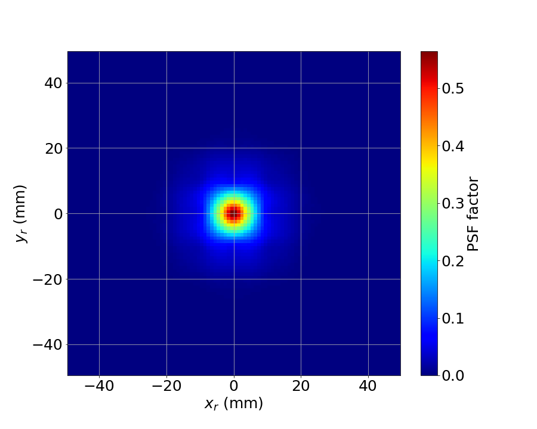
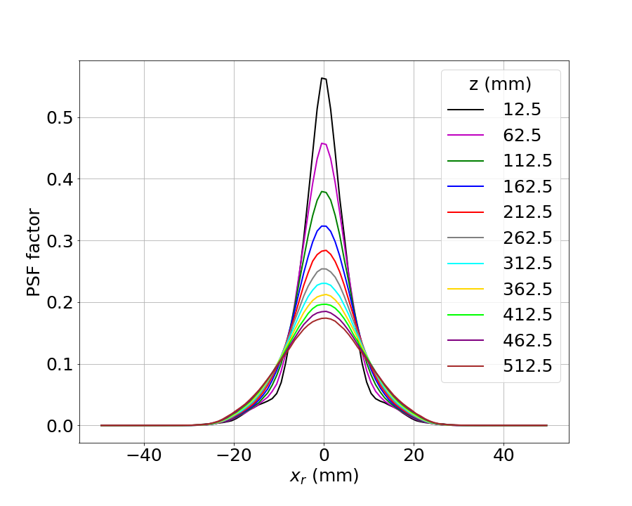

Eutropia
========

*From ancient Greek, ευτροπία: docile, of good manners, versatile, variable.*

The Point Spread Function (**PSF**) is a function that describes the
pattern of light produced by a point-like source. In the context of
NEXT, the **PSF** describes the fraction of charge (:math:`q_{rel}`)
detected by a SiPM as a function of the transverse distance
(:math:`\Delta r = \sqrt{(\Delta x)^2 + (\Delta y)^2}`) to the
emission point. Even though in reality this is a continuous function,
in practice we implement this function as a series of (:math:`\Delta
r`, :math:`f`) points, where :math:`f` is the average fraction of
detected light at a distance :math:`\Delta r`.

To obtain the **PSF**, we use :math:`^{83m}Kr` events, due to their
point-like nature. High energy electrons are not suitable for this
task, due to their complex topology. :math:`^{83m}Kr` events produce
highly localized energy depositions (the closest we can achieve to a
true point-like source) with fixed energy.

The **PSF** depends strongly on the z coordinate due to the effect of
electron diffusion as they drift: it is narrower for short drift and
wider for long drifts. Therefore, we do not produce a single PSF, but
a collection of them, for different slices in z. The city has also the
possibility of producing **PSF**\ s in different (x,y) sectors of the
chamber to account for defects in the Tracking Plane.

**PSF**\ s are generated from **Hits** produced with a specific
:doc:`penthesilea` [#]_ configuration. For each z-slice and
x,y-sector, the city produces the distribution of :math:`q_{rel}` vs
:math:`\Delta r`. This distribution is discretized in :math:`\Delta x`
and :math:`\Delta y` bins and averaged over a large number of events.

The **PSF** is later used by :doc:`beersheba` to reverse the effects
of electron diffusion and light emission and obtain the original
charge deposition.

.. _Eutropia input:

Input
-----

 * ``/Run/events``: Table containing the event number and timestamps.
 * ``/Run/runInfo``: Table containing the run number for each event.
 * ``/RECO/Events``: Table containing the hits produced by
   :doc:`penthesilea`.

.. _Eutropia output:

Output
------

 * ``/PSF/PSFs``: Table containing all the **PSF**\ s
   generated. Columns: xr, yr, zr, x, y, z, factor, nevt.

The columns xr, yr represent the center of each :math:`\Delta x` and
:math:`\Delta y` bin, respectively.  The column zr is always 0 and
will be removed in the future.  The columns x, y, and z indicate the
center of the x-sector, y-sector and z-slice in which the **PSF** was
generated.  The columns factor and nevt are the **PSF** value and the
number of events used to produce that number. This table might contain
multiple **PSF**\ s (and it usually does), particularly for different
z-slices.




.. _Eutropia config:

Config
------

Besides the :ref:`Common arguments to every city`, *Eutropia* has the
following arguments:

.. list-table::
   :widths: 50 40 120
   :header-rows: 1

   * - **Parameter**
     - **Type**
     - **Description**

   * - ``xrange | yrange``
     - ``Sequence[float]``
     - Ranges for the binning of :math:`\Delta x` and :math:`\Delta
       y`.

   * - ```zbins``
     - ``Sequence[float]``
     - Bin edges for the z-slices. A set of **PSF**\ s (one for each
       x-y sector) will be produced in each bin.

   * - ``xsectors | ysectors``
     - ``Sequence[float]``
     - Bin edges for the x,y sectors. A **PSF** will be generated for
       each (x, y) sector and z-slice.

   * - ``bin_size_xy``
     - ``float``
     - Bin size for :math:`\Delta x` and :math:`\Delta y`.

.. warning::
  A large 'PSF size' (defined by the ``xrange | yrange`` and 
  ``bin_size_xy``) in conjunction with a large number of ``zbins``
  can cause excessive memory usage.
  To avoid this issue, ensure that your ``xrange | yrange`` do not
  exceed the PSF tails (~100mm for NEXT100), or use a smaller number
  of ``zbins`` as a unique PSF is produced for each bin.

.. _Eutropia workflow:

Workflow
--------

Eutropia performs a number of data transformations in order to obtain
the **PSF**\ s. These operations can be grouped in three main tasks,
performed in the following order:

 * :ref:`Prepare data slices <Prepare data slices>`
 * :ref:`Compute the PSFs <Compute the PSFs>`
 * :ref:`Combine PSFs <Combine PSFs>`


.. _Prepare data slices:

Prepare data slices
:::::::::::::::::::

First, the events are grouped into x,y,z-slices according to the
parameters `zbins`, `xsectors` and `ysectors`. Each of these sectors
will have its own **PSF** [#]_. These sectors can be identified in the
output data by their central values (columns `x`, `y` and `z` of the
output table). The procedure that follows is then applied to each of
these datasets independently.

The hits coming from :doc:`penthesilea` do not contain entries with
null charge [#]_. However, SiPMs with null charge should also be
considered as part of the light response map. Thus, in this step, the
missing hits are added to the dataset with zero charge. Next, the
charge distribution is normalized to 1 for each event. Finally, the
relative coordinates (:math:`\Delta x` and :math:`\Delta y`) are
computed by subtracting the barycenter from each SiPM position.


.. _Compute the PSFs:

Compute the **PSF**\ s
::::::::::::::::::::::

The charge distribution for all events is then histogrammed in
:math:`\Delta x` and :math:`\Delta y`. The binning of these histograms
is determined by the parameters `xrange`, `yrange`, and
`bin_size_xy`. The **PSF** factor in each bin is defined as the
average normalized charge: :math:`\sum q_{rel} / n_{evt}`, where
:math:`n_{evvt}` is the number of events used to calculate the **PSF**
factor. An example of such histogram is shown below.



A 1d-slice of this histogram (for :math:`\Delta y = 0`) is represented
below for different z-slices, demonstrating why it is necessary to
generate separate **PSF**\ s for various ranges of z.



.. _Combine PSFs:

Combine **PSF**\ s
::::::::::::::::::

In order to produce accurate **PSF**\ , a large number of events is
necessary. At the same time, it is neither possible (in terms of
memory) nor efficient to process a large number of events at once. The
approach is thus to produce **PSF**\ s with the same parameters from
fewer events and merge them afterwards. This option is available both
within the city and externally as a separate tool. Because the city
accepts many input files, it will run the **PSF** generation for each
file independently and merge them later. The external tool follows the
exact same methodology [#]_.

A **PSF** value is by construction an average of normalized
charges. Therefore, an arbitrary number of **PSF** entries with values
:math:`f_k` produced with :math:`n_k` events can be combined into a
single entry with :math:`\sum_k n_k` events and value

.. math::

   \frac{\sum_k f_k \cdot n_k}{\sum_k n_k}


.. [#] The `rebin` parameter in :doc:`penthesilea` must be set to a
       large number (e.g. 10000) in order to obtain **Hits** for
       events integrated over the longitudinal axis.

.. [#] While it is common to generate separate **PSF**\ s for
       different z-slices, so far we haven't assessed the performance
       of the deconvolution using **PSF**\ s for different x,y-sectors

.. [#] Technically, they do not contain entries with charge below a
       certain configurable threshold. This value should be reasonably
       low to describe the tails of the **PSF** distribution
       accurately.

.. [#] This allows to process each file in a separate core of a
       computer cluster and merge the files later. This is much
       faster than running them sequentally. This tool will
       eventually be included in IC, but it's hosted temporarily in a
       `github gist
       <https://gist.github.com/gonzaponte/5af3ff1176eba8b16d0e5e45c6bc59ed>`_.
