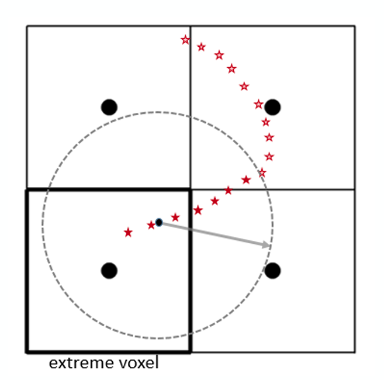

Isaura
======

*From ancient greek, Ισαυρία: an ancient rugged region in Asia Minor.*

This city computes tracks and extracts topology information from **deconvoluted hits** (**ddst**). Therefore, it is analogous to the final stage of :doc:`esmeralda`. Unlike the latter, the input hits correspond to the deconvoluted ones coming from :doc:`beersheba` (instead of :doc:`penthesilea`), allowing us to obtain a finer tracking of events.

.. _Isaura input:

Input
-----

 * ``/Run/events``
 * ``/Run/runInfo``
 * ``/DECO/Events``
 * ``/DST/Events``

.. _Isaura output:

Output
------

 * ``/Tracking/Tracks``: tracking-related information of events (in particular: track energy (``energy``), track length (``length``), number of voxels (``numb_of_voxels``), number of hits (``numb_of_hits``), minimum and maximum position computed with the hits comprising the track (``x_min``, ``y_max``, ...), blobs position (``blob1_z``, ``blob2_x``,...) and energy (``eblob1``, ``eblob2``), energy of the hits shared by both blobs (``ovlp_blob_energy``), and voxel size (``vox_size_x``, ``vox_size_y``, ``vox_size_z``). Each row corresponds to a different track, specified among the others within an event with its ``trackID``.
 * ``/Summary/Events``: global information related to the event. Each row is one event.
 * ``/DST/Events``: copy of the point-like information (**kdst**) of events, output of :doc:`penthesilea`.
 * ``/Filters/hits_select``: flag to indicate if an event passes the selection of having more than 0 hits. 
 * ``/Filters/topology_select``: flag to indicate if an event passes the selection of having less hits than the ``max_num_hits`` parameter specified in the config file.
 * MC info: copy of the Monte Carlo information for the events that the city outputs. Only if ``run_number`` < 0. The tables included are: ``/MC/configuration``, ``/MC/hits``, ``/MC/particles``, ``/MC/sns_positions``, and ``/MC/sns_response``.

.. _Isaura config:

Config
------

Apart from the :ref:`Common arguments to every city`, the parameters to run *Isaura* are the following:

.. list-table::
   :widths: 50 100 120
   :header-rows: 1

   * - **Parameter**
     - **Type**
     - **Description**

   * - ``vox_size``
     - ``[float,float,float]``
     - X, Y, and Z dimensions of the voxels used in the voxelization of the hits.

   * - ``strict_vox_size``
     - ``bool``
     - Flag to indicate if the size of the voxels is forced to be exactly the values provided in the previous argument (*True*),

       or, on the other hand, if they are allowed to change a bit for each track, aiming to optimize the voxelization process (*False*).

   * - ``energy_threshold``
     - ``float``
     - If the energy of one of the original end-point voxels is smaller than this value,

       the voxel will be dropped and its energy redistributed to the neighbours.

   * - ``min_voxels``
     - ``int``
     - The voxel dropping procedure commented in ``energy_threshold`` can only happen if the number of voxels is larger than the value specified in this argument.

   * - ``blob_radius``
     - ``float``
     - Radius of the blobs.

   * - ``max_num_hits``
     - ``int``
     - Maximum number of hits for an event to be processed.

       Events with more hits are filtered out and their ID will not appear in the ``Filters/topology_select`` table of the output.

.. _Isaura workflow:

Workflow
--------

The basic idea behind Isaura is to run the "traditional" *Paolina* algorithm over the deconvoluted hits output in :doc:`beersheba`, in order to convert ``events`` into ``tracks`` with ``blobs``. This process can be divided into two main steps:

 * :ref:`Event selection based on the contained hits <Hits-based selection>`
 * :ref:`Topology-related information extraction <Extracting the topology-related information>`, performed in different stages:

    #. :ref:`Studying connectivity of events <Connectivity>`
    #. :ref:`Searching the position of blobs <Blobs position>`
    #. :ref:`Computing blobs energy <Blob energy>`

.. _Hits-based selection:

Event selection based on the contained hits
:::::::::::::::::::::::::::::::::::::::::::

First of all, it is mandatory to perform some selections concerning the number of hits that events contain, in order to be able to compute all the tracking information for each of them.
  
The first condition that all events must fulfill to be processed is to contain at least one hit. If that does not happen, the event will be rejected, which will be displayed in the table ``Filters/hits_select``.

The next step within the algorithm consists in checking that the number of hits is lower than the value provided in the config file (``max_num_hits``). That argument was introduced because, when running *Paolina* algorithm after :doc:`penthesilea`, there were some events that comprise such large amount of hits that the tracking information extraction took a ridiculously long time. The following picture shows the number of *Penthesilea hits* (**hdst**) per event (with a different scale) for a typical 24h-long low-background run included in the NEXT-White double-beta analysis [#]_. High energy (trigger2) events usually contain around 200 Penthesilea hits (as right panel points out), while there are some with more than 10000 hits (illustrated in left panel).

 .. image:: images/isaura/nhits_per_evt_r8571.jpg
   :width: 1000

The plot also shows that these events only  appear a few times within a 24h-long low-background run (around 0.05% of the total set of events). Rejecting this type of event is not a particularly worrysome issue: they would be thrown away in the posterior analysis, owing to the fact that none of them are exclusively contained inside the fiducial volume. The spatial distributions for one of these events is presented below (where the grey dashed lines illustrate the boundaries of the chamber).

 .. image:: images/isaura/XY_Z_distributions_evt_many_hits.jpg
   :width: 1000

In any case, one can easily infer from the plots that these events are not physical. On the contrary, they seem to correspond to either some kind of flash occurring in the chamber (like a mini-spark) or some fail in the electronics (after the saturation of an alpha particle, for example). The ID of the events that are removed from the reconstruction chain because of this reason will be specified in the table ``Filters/topology_select``, in order to keep track of this information.

..
 Next step includes another (quite obvious) check: at least one hit inside the event must have a well-defined energy. If not, the event will be also rejected, since no topological information could be extracted.

Finally, every event is also required to contain hits with well-defined energy. For instance, events with all hits outside the krypton correction map boundaries will be thrown away, since their energy cannot be corrected and their ``Ec`` variable (*corrected energy*) will be ``NaN``.

.. _Extracting the topology-related information:

Extracting the topology-related information
:::::::::::::::::::::::::::::::::::::::::::

An excellent topological discrimination between signal and background (thanks to the usage of a gaseous medium inside the TPC) is one of the fundamental trademarks of the NEXT experiment. That is achievable thanks to the exploitation of the so-called **blobs**. They are defined as imaginary 3D spheres located around both ends of each track. Their energy is an excellent tool to investigate whether there has been a large and sudden energy deposition in the track extreme (i.e. *Bragg peak*, indicating the stopping point of a charged particle) or not (starting point of its trajectory). Therefore, that will be a crucial stage within the reconstruction chain, since if it is performed correctly, it will allow separating double-electron (such as the double-beta signal) from single-electron (the majority of backgrounds) tracks.

In order to achieve that, it is necessary to:

    #. :ref:`separate the different tracks that may form the event (event connectivity), <Connectivity>`
    #. :ref:`find the extremes for each of them, to obtain the blob center position, <Blobs position>`
    #. :ref:`compute the energy around these points. <Blob energy>`

The following subsections explain each of these processes in detail.

.. _Connectivity:
 
**Separating events into tracks**

Once events are properly selected according to the :ref:`previous subsection <Hits-based selection>`, their hits are grouped into 3D volume elements (``voxels``) with the objective of studying the connectivity. The size of these voxels is more or less fixed (depending on the ``strict_vox_size`` parameter in the config file), and their energy correspond to the sum of the energy of the hits included in the voxel. Following a Breadth-First Search (BSF) [#]_ algorithm, the voxels sharing a side, edge, or corner will be part of the same **track**. The figure below shows the voxelization result of a real NEXT-White data (Run-VI) single-electron candidate of 1.73 MeV. In this case, after grouping the *deconvoluted hits* into [5 mm x 5 mm x 5 mm] voxels, the event was classified as single-track.

.. _Isaura display:

 .. image:: images/isaura/r8250_evt194237_dhits.png
   :width: 44.8%
 .. image:: images/isaura/r8250_evt194237_voxels.png
   :width: 53%

.. _Blobs position:

**Searching blobs position**

To compute the position of the blobs, we need to find the two extreme voxels of the track, which is done following the BFS algorithm. Then, as the figure below illustrates, the energy-weighted averaged position of the hits (represented with red stars) inside these voxels will correspond to the **blob center** (represented with the black dot from where the grey arrow starts).

The first thing to do is to localize the two end voxels for each track. Defining the distance between any pair of voxels as the shortest path **along the track** that connects them, the two extreme voxels will be the ones with the longest distance between them. However, there are two special cases that are important to comment:

 - It is possible that some spurious **low-energy** hits appear around the track (due to over-iterations during the Richardson-Lucy deconvolution process, as commented in :doc:`beersheba`; or some noise inside the chamber, for example). If these hits are reconstructed around the track but not far enough to produce a different S2 or track (taking into account the voxel size), they can be considered as a part of the main one and, being a bit separate, it is probable that they end up belonging to an extreme voxel. That case would not be correct, and in order to solve it, the voxel will be dropped from the track and its energy passed to the closest one. This process is only carried out if the voxel energy is lower than ``energy_threshold`` and the track is made by more than ``min_voxels`` voxels. Once this procedure is done, the extreme voxels are searched and found again recursively, until none of these conditions are fulfilled.

 - Another particular scenario is the one that comes up when there are multiple end-voxel candidates (one can imagine that the shorter the track the more probable this is to happen). To deal with it, the more energetic candidates will be the ones set as extremes. With this convention, we aim to minimize the use of the voxel-dropping algorithm commented above for those cases where the energy of one candidate is larger than ``energy_threshold`` while the other one is below that value. 

Once the extreme voxels are properly found, the center position of the blobs --stored in the ``Tracks/Tracking`` table as: ``blobi_x``, ``blobi_y``, and ``blobi_z``, (with ``i`` being 1, 2), respectively-- is computed in accordance with the figure previously presented.

.. _Blob energy:

**Blob energies computation**

From these blob centers, 3D spheres of radius ``blob_radius`` (specified in the config file) are taken. The hits inside the sphere will contribute to the energy of the blob, that will be stored as ``eblob1`` and ``eblob2`` [#]_. It is relevant to take into account here that not every hit falling inside the blob sphere will be considered for its total energy, but only the ones that belong to a voxel adjacent to the one labeled as extreme.

The final step of the *Paolina* algorithm includes the computation of the ``ovlp_blob_energy`` (“*overlap blob energy*”) variable: in short tracks it is common to have **overlapping blobs**, i.e. blobs that share some of their hits [#]_. In these cases, the ``eblobi`` variables become meaningless, since the energy of these hits would contribute to both blobs [#]_. Therefore, it will be interesting to reject this type of event during the posterior analysis in case the blob energy distributions are intented to be exploited. Owing to the fact that the aforementioned variable is defined as the total amount of energy of these shared hits, a selection of ``ovlp_blob_energy = 0`` will get rid of the corresponding events easily.

 .. image:: images/isaura/RunVI_b_evt_1720keV_XYZ.jpg
   :width: 1200

The XY (d), XZ (e) and YZ (f) projections of deconvoluted hits, along with the blobs computed with this algortihm, for the same event as the one shown before (in the voxelization plot) can be seen above. This image illustrates how the blobs seem to be computed perfectly. According to our reconstruction, it corresponds to a clear single-electron event (background), due to the noticeable difference between the energy of its blobs: ``eblob1`` = 755 keV, whereas ``eblob2`` = 104 keV.

           
`Isaura` comprises the last step within the NEXT reconstruction chain. Therefore, after it, we have access to all the relevant information to perform the analysis. This information is finally stored in different tables, as the :ref:`Output <Isaura output>` subsection indicates.

 .. [#] It is important to realize that the hits considered for the plot are the ones from :doc:`penthesilea`. Events coming from :doc:`beersheba` comprise a much larger amount of *deconvoluted hits* (more than one order of magnitude), given the finer granularity.

 .. [#] T H Cormen, C Stein, R L Rivest, and C E Leiserson, Introduction to algorithms. McGraw-Hill Higher Education, 2nd ed., 2001.

 .. [#] As a convention, the assignment of ``1`` and ``2`` is defined in such a way that ``eblob1`` > ``eblob2``.

 .. [#] One could think that this effect will also happen in long intricate tracks, where both end points turn out to be close. Nevertheless, and as it has been explained above, the blob energy is only computed using the hits inside the blob sphere **and** belonging to the extreme voxel or its adjacent ones **along** the track. As a consequence, these scenarios are successfully avoided.

 .. [#] As an illustrative (and extreme) example, one could realize that ``eblob1 = eblob2 = ovlp_blob_energy = energy`` for a point-like (or very short) event, which is incoherent, since the relationship: ``(eblob1+eblob2) <= energy`` should be satisfied.
